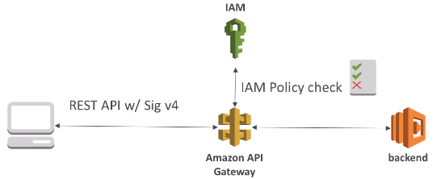
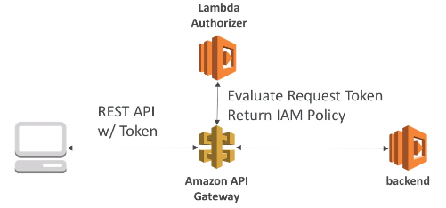
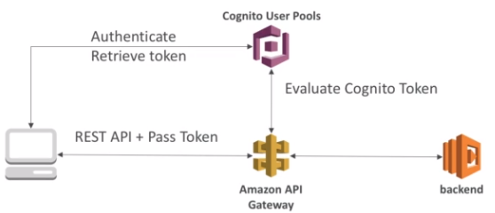

### API Gateway
AI Gateway provides HTTP endpoints in front of Lambdas or HTTP endpoints + additional features:
* Supports Websocket, RT streaming
* Versioning, e.g. `/v1, /v2`
* Handles multiple envs: dev, test, prod
* Handles security: auth+auth
* Can create API keys and handle requests throttling
* Swagger/OpenAPI import to quickly define APIs
* Transform and validate requests and responses
* Cache API responses

API type is selected upon creation:
* HTTP API
* WebSocket
* REST API / REST API prvate

Endpoint types can be:
* Edge-optimized. For global clients. Requests are routed through CloudFront edge locations => improved latency. The Gateway itself stays in one region.
* Regional. For clients within same region. Is not integrated with CLoudFront edge locations by def but it can be added manually to have some improve  improvements as above.
* Private. Can be accessed only in the VPC using an interface VPC endpoint (ENI). Resource policy is used to define access.

Endpoint integration types:
* HTTP
* Lambda
* Mock
* AWS Service
* VPC Link

#### Timeout
API Gateway has a default (and max) timeout of 29secs when calling a target.

#### Security
1. IAM Permissions
* Create an IAM policy authorization and attach to User / Role
* API Gateway verifies IAM permissions passed by the calling app
* Good to provide access within your own infra.
* Leverages `Sig v4` capability where IAM creds are in headers.

Use case: **to give permissions to users in your AWS acc.**

2. Lambda Authorizer (formerly Custom Authorizer)
* Uses a Lambda to validate a token in headers
* Option to cache a result
* Lambda must return and IAM policy for the user

Use case: **helps with 3rd party types of auth: OAuth, SAML**

3. Cognito User Pools
* Cognito fully manages user lifecycle
* API Gateway verifies identity automatically from AWS Cognito
* No custom implementation required
* :exclamation: Cognito only helps with authentication, not authorization.

Use case: **Client manages his own user pool in Cognito. Can be backed up by Facebook, Google login etc. Authorization layer must be implemented in backend**

