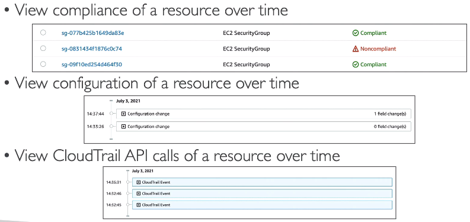
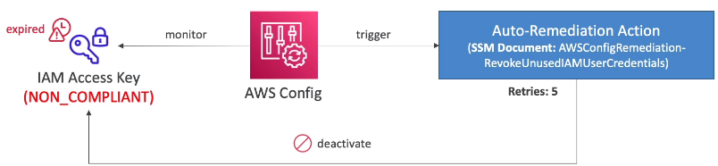

### AWS Config
AWS Config lets you assess, audit, and evaluate the configurations of your AWS resources.\
Use cases: 
* Is there unrestricted SSH access to my SGs?
* Do my buckets have any public access?
* How has my ALB config changed over time?

It is possible to receive SNS notifications for any changes.\
AWS Config is a per-region service but can be aggregated across regions and accounts.\
It is possible to store data into S3 and analyze with Athena.

#### Config rules:
* AWS managed config rules (over 75)
* Can create a custom rule, e.g.:
  * evaluate if each EBS disk is of type `gp2` 
  * evaluate if each EC2 is of type `t2.micro`
* Rules can be evaluated for each config change or at regular time intervals

#### Remediations
Config rules do not do anything with non-compliant resources.\
However it is possible to set up automatic remediations in certain cases using the **SSM Automation Documents**.\
It is possible to create custom Automaton Documents that invokes Lambda func.

Use case example:\

