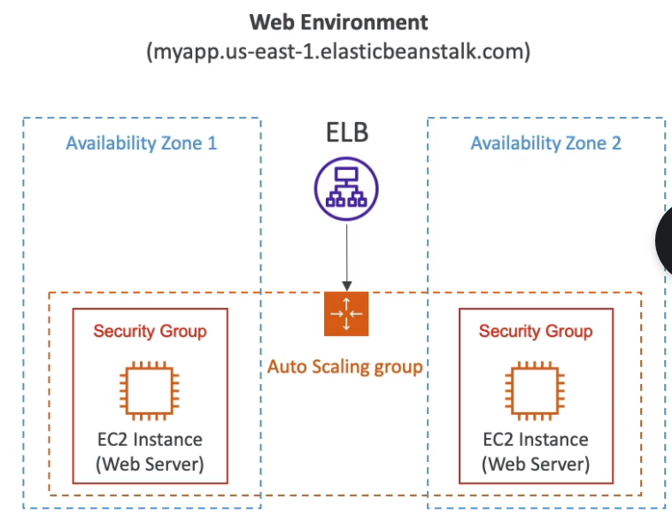
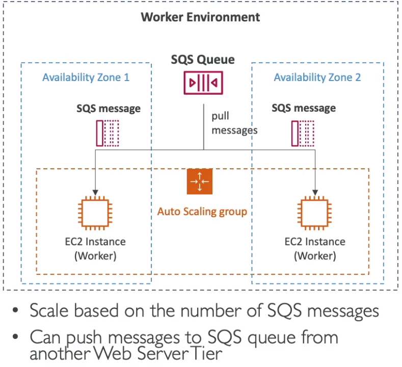

### Elastic Beanstalk
A service to re-use components for deployments: EC2, ASG, ELB, RDS...
* Automatically handles capacity provisioning, load balancing, app health monitoring, instance configuration...
* The responsibility of a developer is only application code.
* Full control over configuration remains
* Free of charge

Consists of:
* Application
* App version - iteration of app code
* Environment
  * Collection of AWS resources running ab app version (only one app version at a time)
  * Tiers: Web server tier vs Worker tier
  * Multiple envs: dev, test, prod...

Supports runtimes:
* Go
* Java SE/ Java with Tomcat
* .NET win/linux
* Node.js
* Python
* PHP
* Ruby
* Packer build
* single/multi docker containers, pre-configured docker

Beanstalk has some preconfigured templates, e.g. "single instance", "single spot instance", "hi avail" etc.

#### Web server tier vs Worker tier

