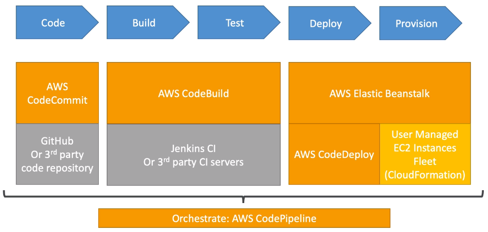

### AWS CI/CD

**CodeCommit**: service where you can store your code. Similar service is GitHub

**CodeBuild**: build and testing service in your CICD pipelines

**CodeDeploy**: deploy the packaged code onto EC2 and AWS Lambda

**CodePipeline**: orchestrate the actions of your CICD pipelines (build stages, manual approvals, many deploys, etc)

**CloudFormation**: Infrastructure as Code for AWS. Declarative way to manage, create and update resources.
