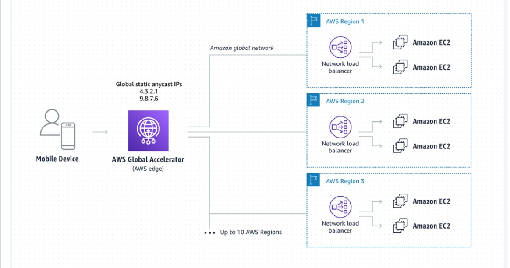

### CloudFront

CloudFront is a CDN.\
It improves read performance as content is cached and edged.\
216 Points of presence globally = edge locations.\
Embedded DDoS protection, integration with AWS Shield and WAF.\
Can expose external HTTPS and can talk to internal HTTPS backends.

CloudFront origins:
* S3 buckets
  * Enhanced security with Origin Access Identity (OAI)
  * CloudFront can be used as an ingress to upload files to S3
* Custom Origin (HTTP)
  * ALB
  * EC2 instance
  * S3 Website
  * Any HTTP backend

CloudFront works as a write-through cache. An "Edge location" intercepts clients GET requests with their **query strings** and **headers**.

CloudFront provides a DNS hostname to access data like `df41nr17o8fgm.cloudfront.net`

#### Access control
For S3:
1. Need to create OAI - Origin Access Identity which is like IAM role for a CloudFront origin.
2. S3 Bucket policy must be updated. Can be done automatically when CLoudFront is configured.

For EC2:
1. EC2 must be public and its SG must allow public IP of an edge location

For ALB:
1. ALB must be public, EC2 can be private. SG of ALB must allow public IP of an edge location.

#### Georestriction
Restricts who can access data with either Whitelist or Blacklist.\
Use case: copyright laws.

#### CloudFront vs S3 CRR (Cross Region Replication)
CLoudFront
* Global
* Great for static content that must be available globally
* Files are cached for TTL (maybe a day)
* Content may be outdated

S3 CRR
* Must be set up for each Region
* Replication in near real time
* Read only
* Great for dynamic content that must be available at lo latency in few regions

#### CloudFront Signed URLs / Signed Cookies
Use case: distribute paid restricted content.\
We can use CloudFront Signed URLs / Signed Cookies. We attach a policy with:
* URL expiration
* IP ranges to access the data from
* Trusted signers (which AWS accs can create signed URLs)

URLs can be valid for minutes (temporary media content) or years (private user's files).\
Signed URL gives access to individual files whereas Signed Cookies are useful to access multiple files.

To provide an end-user with a signed URL it is necessary to have an app that will authorize a user and will generate a Signed URL using AWS SDK and requesting AWS CloudFront. Then the app returns a signed URL to the user.

CloudFront Signed URLs vs S3 Pre-signed URLs:
* CloudFront Signed URLs allows access to a path, no matter the origin (not only S3). It is an account wide key-pair, only the root manages it.
* S3 Pre-Signed URLs issue a request on behalf of a person who pre-signed the URL. Uses IAM key of the signing IAM principal. Only allows access to S3. Has limited lifetime.

#### Price classes
CloudFront access data price is different per regions and costs can be controlled with price classes
* Price Class All - all regions, best performance
* Price Class 200 exclude most expensive regions, e.g. Australia
* Price Class 100 include least expensive regions - North America and Europe

#### Multiple Origin
The routing can be to different origins based on path pattern, e.g. all `/api/*` is routed to ALB and the rest `/*` is routed to S3.

#### Origin Groups
To increase hi avail and do failover.\
A group has one primary origin and one secondary origin.\
The secondary is used when the primary fails.

#### Field level encryption

Field-level encryption allows you to enable your users to securely upload sensitive information to your web servers.\
The sensitive information provided by your users is encrypted at the edge, close to the user, and remains encrypted throughout your entire application stack.\
This encryption ensures that only applications that need the data—and have the credentials to decrypt it—are able to do so.

To use field-level encryption, when you configure your CloudFront distribution, specify the set of fields in POST requests that you want to be encrypted, and the public key to use to encrypt them.\
You can encrypt up to 10 data fields in a request.\
(You can’t encrypt all of the data in a request with field-level encryption; you must specify individual fields to encrypt.)

### Global Accelerator
AWS Global Accelerator is a network layer service that directs traffic to optimal endpoints over the AWS global network,
this improves the availability and performance of your internet applications.
It provides two static anycast IP addresses that act as a fixed entry point to your application endpoints in a single or multiple AWS Regions.

Global Accelerator endpoints can be:
* Elastic IP
* EC2 instances
* ALB
* NLB

AWS Global Accelerator uses endpoint weights to determine the proportion of traffic that is directed to endpoints in an endpoint group,
and traffic dials to control the percentage of traffic that is directed to an endpoint group (an AWS region where your application is deployed).

Scenario:
An app (ALB) is deployed in one region.\
Clients use it globally. There is need to reduce latency.

Unicast IP - one server holds one IP address.\
Anycast IP - all servers hold the same IP address and clients are routed to the nearest one.\
GA uses Anycast IP and AWS global network and its edge locations to route traffic to the optimal regional endpoint based on health, client location, and policies.\
GA gets 2 static IP addresses.\
The static IP addresses accept incoming traffic onto the AWS global network from the edge location that is closest to your users.

GA assigns each accelerator a default DNS name that points to the 2 static IP addresses.\
GA perform healthchecks on the app and does automatic failover in case on of targets fails.

#### Global Accelerator vs CloudFront
Global Accelerator:
* Improves performance for applications over TCP or UDP, e.g. gaming, IoT, VoIP.
* No caching
* Regional failover
* Has embedded app healthchecks

CloudFront:
* improves performance for cacheable content, e.g. media
* content is served at the edges
