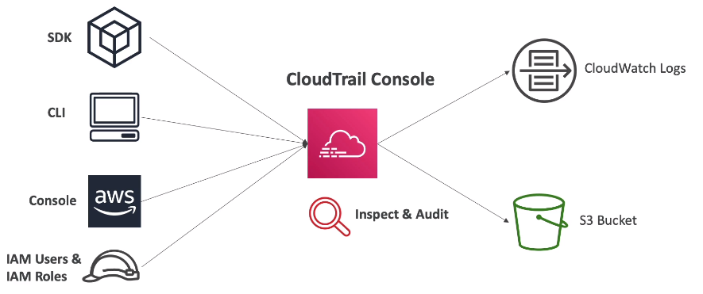

### CloudTrail
Provides governance, compliance and audit for AWS account.\
Everything that modifies resources within the account will appear in CloudTrail.\
CT is enabled by default.\
CT can put logs into CloudWatch Logs or S3.\
CT can be applied to all regions(default) or a single region.

Use case: an EC2 was deleted. Who did it? Investigate in CloudTrail first.\

CT can capture:
* **Management events**. Operations that are performed on resources in account. Enabled by default
* **Data events**. Not logged by default (produce al ot of data). Example: S3 object-level activity.
* **Insight Events**. Must be enabled and is a paid service. Used to detect unusual activity in account,
  e.g. inaccurate resource provisioning, hitting resource limits, bursts of IAM actions etc.
  CT Insights analyze normal management events to create a baseline and then continuously
  analyzes **write** events to detect unusual patterns.

CT Events are stored for 90 days and then deleted.\
To keep them it is possible to send them to S3 and then use Athena to analyze them.
