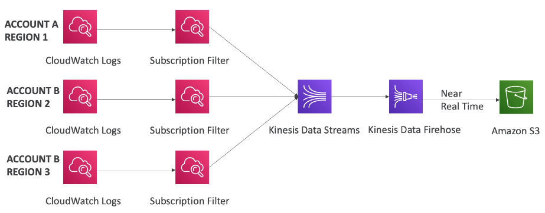

### CloudWatch

CloudWatch provides metrics for every service in AWS.
* Metrics belong to **namespaces**. A namespace is a container for CloudWatch metrics. Metrics in different namespaces are isolated from each other, so that metrics from different applications are not mistakenly aggregated into the same statistics. The AWS namespaces typically use the following naming convention: AWS/service. For example, Amazon EC2 uses the AWS/EC2 namespace.
* **Dimension** is an attribute of a metrics (instance_id, environment, etc.). There can be up to 10 dimensions per metric.
* Metrics have timestamps

#### EC2 metrics
Scraped every 5 mins by default.\
With **detailed monitoring** time interval can be reduced to 1 min.\
:exclamation: detailed monitoring makes ASG scaling faster!

AWS Free tier allows 10 detailed metrics.\
EC2 memory usage is not pushed by default (can be pushed from inside the instance as a custom metric).

#### Custom metrics
Use API `PutMetricData`. Apply dimensional attributes optionally.\
Set metrics resolution with `StorageResoltion` API param:
 * Standard: 1 min
 * Hi res: 1/5/10/30 sec. Higher cost

Cloudwatch can accept custom metrics data points 2 weeks in the past and 2 hours in the future.

A metric can be pushed via AWS CLI with the `aws cloudwatch put-metrics-data`.

#### CloudWatch dashboards

Dashboards are global and can include graphs with metrics **from different AWS accounts** and multiple regions.\
A dashboard can be shared with people outside of AWS account (public email address, 3rd party SSO provider through AWS Cognito).

Pricing:
* 3 dashboards (up to 50 metrics) for free
* $3 per dashboard per month afterwards

### CloudWatch Logs
* **Log group**: arbitrary name, usually representing an application
* **Log stream**: an instance within app / log files / containers. `STDOUT` and `STDERR` can be in separate streams.
* Client can define log retention policies: never expire, 30 days, etc
* CloudWatch logs can send logs to:
  * S3
  * Kinesis Data Streams, Kinesis Data Firehose
  * AWS Lambda
  * ElasticSearch
* Sources (what can send logs):
  * SDK, CloudWatch Log Agent, CloudWatch Unified Agent
  * Beanstalk: collection of logs form application
  * ECS: collection from containers
  * Lambda: collections from functions
  * VPC flow logs: VPC specific logs
  * API Gateway requests
  * CloudTrails can send logs directly based on filters
  * Route53 logs DNS queries

#### CloudWatch Logs Metric Filters
CloudWatch Logs can use filter expressions to create a _Metric Filter_, for example:
 * find specific IP in logs
 * count occurrences of `ERROR` in logs

After the custom metric is created, we can create a new custom CloudWatch Alarm from it,
when for example the metric value exceeds a certain threshold.

#### CloudWatch Logs Insights
Insights can be used to query logs and add queries to CloudWatch dashboards.\
There is a dedicated query language with query examples in Console.

#### Export to S3
Log data can take up to 12 hours to become available for export.\
The API call is  `CreateExportTask`.\
Not real-time or near-real-time, for this use Log Subscriptions instead.

#### CloudWatch Logs Subscription Filters
Subscriptions is a filter that can be applied on top of logs and then send them to a destination, for example:
* Lambda -> AWS ElasticSearch (real time)
* Kinesis Data Firehose -> S3 (near real-time, alternative to S3 export)
* Kinesis Data Firehose -> ElasticSearch (near real-time)
* Kinesis Data Streams -> KDF, KDA, EC2, Lambda

#### CloudWatch Logs aggregation Multi-Account and Multi-Region
For logs aggregation Subscription Filters can be used:

#### Collecting logs from EC2
:exclamation: By default, no logs from EC2 machine will go to CloudWatch.\
It is necessary to install a **CloudWatch Agent** on EC2 to push logs.\
For this an EC2 instance must have an appropriate IAM role.\
It is also possible ot install an agent on on-premises servers.

##### Logs Agent vs Unified Agent.
Logs Agent is older version and only sends to CLoudWatch Logs.

Unified Agent is new one.\
Unified Agent has centralized configuration using SSM Parameter Store.\
Apart from logs, it additionally collects system-level metrics with hi granularity such as
* CPU
* RAM
* Disk
* Netstat
* Processes
* Swap space

These metrics are better and more granular than normal monitoring of EC2 instances (which is CPU, disk, network at hi level).

#### CloudWatch Alarms
Alarms are used to trigger notifications for any metric.
* Various options: sampling, %, max, min,...
* Alarm states: `OK`, `INSUFFICIENT_DATA`, `ALARM`
* Period - length of time in secs to evaluate the metric: 10sec, 30sec (for hi res metrics) or N*60sec
* Alarms can have 3 target types:
  * EC2 actions: `stop`, `terminate`, `reboot`, `recover`
  * Trigger ASG action
  * SNS

:exclamation: alarms can be created not only on top of metrics but also on logs > log metrics filters.

:exclamation: You can use CloudWatch Alarms to send an email via SNS

Testing an alarm is possible with
`aws cloudwatch set-alarm-state ...`

##### EC2 instance recovery
You can create an Amazon CloudWatch alarm to automatically recover the Amazon EC2 instance if it becomes impaired.\
:exclamation: Terminated instances cannot be recovered.

* Status check:
  * Instance status = check EC2 VM
  * System status = check underlying hardware
* EC2 instance recovery keeps: same private, public, elastic IPs, metadata, placement group.
* Optionally, it can send an alert to SNS topic

#### CloudWatch Events
CloudWatch Events delivers a near real-time stream of system events that describe changes in AWS resources.\
These help to trigger notifications based on changes happening in AWS services.
* Event pattern: intercepts events from AWS services
  * Example sources: EC2 instance start, CodeBuild failure, S3, Trusted Advisor
  * Can intercept any API call with CloudTrail integration
* Can also be "Scheduled", e.g. create an event every 4 hours
* JSON payload is crated from the event and passed to a target:
  * Compute: Lambda, Batch, ECS Task
  * Integration: SQS, SNS, KDS, KDF
  * Orchestration: S tep Functions, CodePipeline, CodeBuild
  * Maintenance: SSM, EC2 Actions

#### EventBridge
EventBridge is an extension of CloudWatch Events to receive events from 3rd party sources like DataDog, Auth0, Zendesk etc.\
For this there are "partner event buses".\
It is also possible to add a "custom event bus" for your own applications.

EventBridge can analyze events in your bus and infer the schema.\
The Schema Registry allows you to generate code for your applications that will know in advance how data is structured.\
Schema can be versioned and thus allowing events to evolve over time.   
