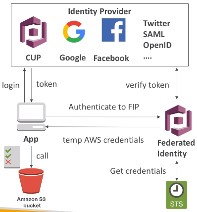

### Cognito

Components:
1. Cognito User Pools:
* Sign in functionality for app users
* Integrated with API Gateway

2. Cognito Identity Pools (Federated Identity)
* Provide AWS Credentials to users to they can access AWS resources directly.
* Integrate with Cognito User Pools as an identity provider.

3. Cognito sync
* Synchronize data from device to Cognito
* May be deprecated an replaced by AppSync

#### Cognito User Pools (CUP)
* ~= serverless database of users
* Simple login: username or email / password combination
* Possibility to verify emails / phone numbers and add MFA
* Can integrate with federated identity providers (Facebook, Google, SAML...)
* Sends back a JWT token which can be used to verify an identity of someone

#### Cognito Federated Identity Pools
* Goal: provide direct access to AWS resources from client side
* How?
  * Login to federated IP (CUP, Facebook, Google, SAML...) or remain anonymous.
  * Provide "Federated Identity Pools" with token.
  * "FIP" calls STS (Security Token Service) to generate temporary, limited-privilege credentials
  * Get temp AWS creds back from "FIP"
  * These creds come with a predefined IAM policy

Example: provide temp access to S3 bucket using Facebook Login:\

