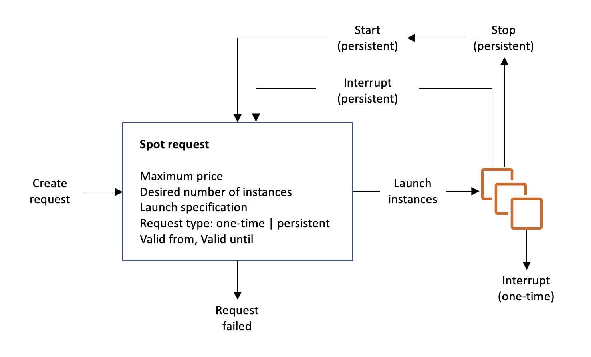

### EC2

EC2 instances parameters: vCPU, RAM, Storage, Network speed, EBS bandwidth.

EC2 instance types: `m5.2xlarge`, where `m` - class, `5` - generation, `2xlarge` - size

|Purpose|Classes|Use cases|
|--|--|--|
|General|T, M,...|
|Compute|C|CPU loading: Batch processing workloads, hi performance servers, media transcoding|
|Memory Optimized|R,X,...|Large datasets in memory, in-memory databases, cache stores|
|Accelerated Computing|P,G,...|floating point calculations, graphics processing|
|Storage Optimized|I,D,H|Lo latency hi throughput IO: Databases, distributed filesystems|

Instances types comparison chart: https://instances.vantage.sh/

#### EC2 User Data script.
The script is run once when a machine starts.\
It is a bash script with `sudo` rights.

#### EC2 Instance connect
It is possible to use "EC2 Instance connect" from a browser from the console page instead of using SSH.\
This still relies on the open ssh port.

#### IAM role
An EC2 can have an attached IAM role (!=SG) and therefore can be authorized to perform action towards AWS resources.

#### Security Groups
SGs contain only `allow` rules.\
SGs allow by IP ranges/ports or by other SGs.\
SGs contain inbound and outbound rules.\
SGs are locked down to a region/VPC combination.\
EC2 or other resource can have several SGs.

Usually connection timeouts indicate SGs misconfiguration.

#### EC2 Instance provision types
* "On demand" (billing per second). High cost, no upfront payment, no commitment.
* "Reserved" (1 year minimum), also Scheduled Reserved. Up to 75% discount. Can be paid upfront.
* "Convertible Reserved" can change types.
* "Spot instance" are unused EC2 capacity that can be bid on and claimed when they become available. Most cost efficient. For short workloads like batch jobs. Spot price changes over time and are different per AZ. An instance is lost when the cost exceeds max budget price.
* "Dedicated host" - a dedicated physical server. For compliance reqs and server-bound software licenses. For 1 or 3 years period.
* "Dedicated instance" - a soft version of dedicated host. Still enables the use of dedicated physical servers. No insight into the underlying sockets and cores.
* Spot Fleet

#### EC2 placement groups:
* cluster - all together in one rack. For HPS and hi throughput
* spread - distributed between AZs. For reducing risks, for  critical apps.\
Each instance is placed in a distinct rack (even within same AZ).\
A spread placement group can span multiple AZs in the same Region.\
You can have a maximum of 7 running instances per AZ per group.
* partition - for Kafka, Hadoop, Cassandra etc. Each partition is placed in a distinct rack.

#### EC2 instance metadata
Metadata is info about EC2 instance.
It allows instances to learn about themselves without using IAM role for that purpose.\
The URL for this is `http://169.254.169.254/latest/meta-data/` \
This is reachable only from EC2 instances, e.g. curl from within a EC2.

For example, when a role is attached to a EC2 instance, in fact the instance fetches short lived credentials from the `http://169.254.169.254/latest/meta-data/iam/security-credentials/{role_name}`

#### EC2 Root Device Volumes
EC2 can start with:
* instance store (not persistable, data is deleted when an instance is terminated)
* EBS root device volume. An instance can be stopped and later restarted without affecting data stored in the attached volume

By default, the root volume for an AMI backed by Amazon EBS is deleted when the instance terminates.\
You can change the default behavior to ensure that the volume persists after the instance terminates.\
To change the default behavior, set the DeleteOnTermination attribute to false using a block device mapping.

You can configure the root volume to persist for a running instance using the command line tools only.

#### EC2 Hibernate
When you hibernate an instance, AWS signals the operating system to perform hibernation (suspend-to-disk).\
Hibernation saves the contents from the instance memory (RAM) to your Amazon EBS root volume.\
AWS then persists the instance's Amazon EBS root volume and any attached Amazon EBS data volumes.

When you start your instance:
* The Amazon EBS root volume is restored to its previous state
* The RAM contents are reloaded
* The processes that were previously running on the instance are resumed
* Previously attached data volumes are reattached and the instance retains its instance ID

#### EC2 Monitoring
By default, Amazon EC2 sends metric data to CloudWatch in 5-minute periods.\
To send metric data for your instance to CloudWatch in 1-minute periods, you can enable `detailed monitoring` on the instance.

#### Collecting logs from EC2
:exclamation: By default, no logs from EC2 machine will go to CloudWatch.\
IT is necessary to install a CloudWatch Agent on EC2 to push logs.\
For this an EC2 instance must have an appropriate IAM role.

#### EC2 instance recovery.
CloudWatch Alarms can be used to trigger EC2 actions: `stop`, `terminate`, `reboot`, `recover`.\
In case of recovery EC2 instance recovery keeps: same private, public, elastic IPs, metadata, placement group.

#### Enhanced Networking
1. **ENA - Elastic Network Adapter** - provides higher bandwidth with 100Gbps.
2. **EFA - Elastic Fabric Adapter** - improved ENA for HPC, works for Linux.\
Good for inter-node communications. It bypasses the OS layer to provide lower latency (works with special MPI interface).  

#### Spot Instances FAQ
To launch a Spot Instance, create a Spot Instance request, or Amazon EC2 creates a Spot Instance request on your behalf.\
The Spot Instance launches when the **Spot Instance request** is fulfilled.\
A Spot Instance request is either **one-time** or **persistent**.\
If the spot request is **persistent**, the request is opened again after your Spot Instance is **interrupted**.

**Spot Instance interruption** – EC2 terminates, stops, or hibernates your Spot Instance when Amazon EC2 needs the capacity back or the Spot price exceeds the maximum price for your request.

:exclamation: canceling the request does not terminate the instance; you must terminate the running Spot Instance manually.

#### Spot Fleet 
With a normal spot instance request, you place a bid for a specific instance type in one specific AZ and hope you get it.\
With spot fleets, you can request a variety of different instance types that meet your requirements.\
Additionally, you can spread your spot fleet bet across multiple AZs to increase the likelihood of getting your instance fulfilled.

By default, Spot Fleets are set to maintain target capacity by launching replacement instances after Spot Instances in the fleet are terminated.\
You can submit a Spot Fleet as a one-time request, which does not persist after the instances have been terminated.\
You can include On-Demand Instance requests in a Spot Fleet request.

#### Spot Blocks
Spot Blocks allow you to request EC2 Spot Instances for 1 to 6 hours at a time to avoid being interrupted.\
Spot Blocks are deprecated and is being phased out.
