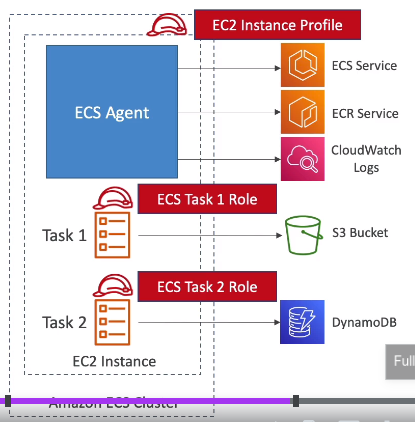

### ECS, ECR, EKS, Fargate

AWS ways to manage containers:
* ECS - container platform
* Fargate - serverless container platform
* EKS - managed Kubernetes

Custom user AMIs can be created from running EC2 instances with installed and configured dependencies.

AMIs are built for a specific AWS Region, they're unique for each AWS Region.\
It is not possible to launch an EC2 instance using an AMI in another AWS Region,
but it is possible to copy AMI to the target AWS Region and then use it to create your EC2 instances.

#### ECS Elastic Container Service
A client must provision and maintain infrastructure, i.e. EC2 instances.\
AWS takes care of starting/stopping containers.\
ECS has an integration with ALB.

#### Launch types:
1. **Amazon EC2 Launch Type for ECS**
* A client first need to create and run a fleet of EC2s.
* ASGs are registered with ECS cluster. To do so a machine must have an ECS agent. AWS AMIs have it pre-installed.
* ECS Task = running container. An EC2 can run many ECS Tasks depending on available resources.

2. **Fargate Launch Type for ECS.**
* A client does not need to provision infra (no EC2s to manage) = serverless.
* AWS runs client's containers based on the CPU/RAM requirements.
* ENIs (Elastic Network Interfaces) will be assigned to ECS Tasks to provide them with IPs
* Because an ENI takes a unque IP, a client needs to make sure there are enough private IP addresses within a VPC

#### IAM Roles for ECS Tasks
ECS Tasks need to have IAM Roles like EC2 instances.

An underlying EC2 need to have permissions:
* Make API calls to ECS service
* Send container logs to CloudWatch
* Pull docker images from ECR
* Fetch data from SSM Parameter Store

ECS tasks need to have their own roles.\
Tasks implementing different services need to have different roles.\
A task role is defined in the task definition.\

#### ECS + EFS
It is possible to mount EFS to both EC2+ECS and Fargate tasks and thus set up data sharing between tasks.\
This is Multi-AZ as EFS is, i.e. tasks from different AZs can share data.\
Use case: persistent Multi-AZ shared storage for containers.

#### ALB integration
ALB can used to route traffic to ECS tasks.\
:exclamation: ALB is able to find the right container ports on EC2 instances automatically, although ports are dynamic.\
:exclamation: For that any port must be allowed on the SG of the EC2 instance from the ALB SG.

For Fargate it is different because each task gets an ENI with unique IP but the port is always 80.\
:exclamation: For that task port must be allowed on the SG of the ENI from the ALB SG.

#### ECS Service scaling
A scaling can be set up based on CPU avg or SQS queue length for example.

#### ECS Rolling updates
When updating from v1 to v2 we can control how many tasks can be started and stopped and in which order:
* min healthy percent - for determining the max number of tasks to terminate. If 50% than no more than half can be stopped.
* max healthy percent - how many new tasks of new v2 can be started. If 100% then no more than was before updating.

#### ECR Elastic Container Registry
Managed storage for docker images.\
Integrated with ECS and IAM for security, backed by S3.\
Supports image vulnerability scanning, versioning, tagging, image lifecycle.

#### EKS Elastic Kubernetes Service
A managed service for automatic deployment, scaling and management of containerized apps.\
It is an alternative to ECS and has different API.\
EKS supports 2 launch modes: EC2 and Fargate.\
:exclamation: Kubernetes is cloud-agnostic, i.e. can be used by any cloud provider.\
Use case: a client uses Kubernetes and migrates to AWS.

Naming differences:
* EKS Pod = ECS Task
* EKS Worker Node = EC2 instances
