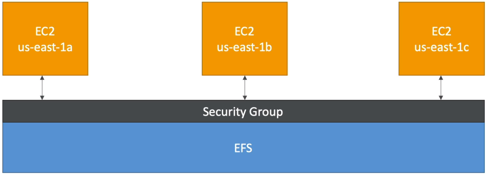

### EFS

Elastic File System - managed network file system that can be mounted on many EC2.\
Works with Ec2 instances in multi-AZ.\
Hihgly available, expensive, pay per use.\
Uses security group to control access.\
Compatible with Linux AMIs only.

Features:
* very hi throughput
* many concurrent NFS clients
* grow seamlessly to petabyte-scale network
* has encryption at rest, automatic backups, different perf modes

Use cases:
* content managing
* web serving
* data sharing
* Wordpress

EFS is created inside the VPC and can be mounted across different AZs (but still the same region).
In each AZ then it can have own SG (or the same SG ).

EC2 hosts can be attached from EFS page.\
The actual mounting happens like `sudo mount -t efs -o tls fs-079fcb09a2624b49c:/ efs`
from inside EC2.\
SG of EFS must allow SGs of EC2 hosts.

#### EFS vs EBS:
* EBS can be attached to only one EC2 at a time
* EBS is locked to one AZ
* 
