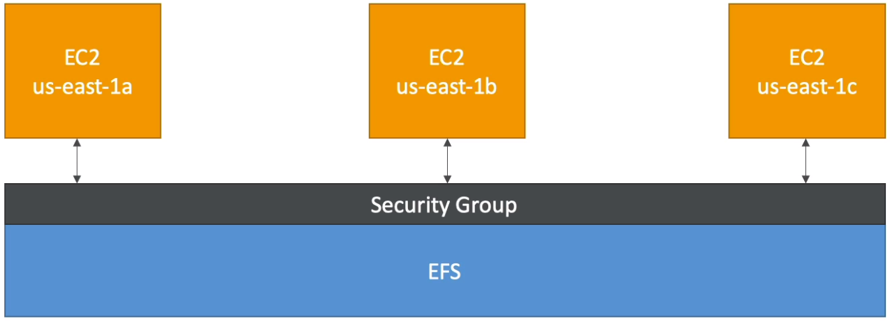

### EFS

Elastic File System - managed network file system that can be mounted on many EC2.\
Works with EC2 instances in multi-AZ.\
Highly available, expensive, pay per use.\
Uses security group to control access.\
Compatible with Linux AMIs only.

Features:
* very hi throughput
* many concurrent NFS clients
* grow seamlessly to petabyte-scale network
* has encryption at rest, automatic backups, different perf modes

Use cases:
* content managing
* web serving
* data sharing
* Wordpress

EFS is created inside the VPC and can be mounted across different AZs (but still the same region).\
In each AZ then it can have own SG (or the same SG ).

EC2 hosts can be attached from EFS page.\
The actual mounting happens like `sudo mount -t efs -o tls fs-079fcb09a2624b49c:/ efs`
from inside EC2.\
SG of EFS must allow SGs of EC2 hosts.

#### EFS vs EBS:
* EBS can be attached to only one EC2 at a time
* EBS is locked to one AZ

#### Performance modes
* **General Purpose** performance mode - lo latency
* **Max I/O** performance mode - hi throughput and ops/sec

#### Throughput modes
* **Bursting**. System's throughput scales as the amount of data stored in the standard storage class grows.
* **Provisioned Throughput**. Instantly provision the throughput of your file system (in MiB/s) independent of the amount of data stored.

#### EFS Infrequent Access (EFS IA)
EFS IA is a storage class that provides price/performance that is cost-optimized for files, not accessed every day, with storage prices up to 92% lower compared to EFS Standard. 

#### Security
* You control which EC2s can access your EFS by using VPC SG rules and IAM policies.
* Use VPC SGs to control the network traffic to and from your file system.
* Attach an IAM policy to your EFS to control which clients can mount EFS and with what permissions
* EFS Access Points to manage application access.
* Control access to files and directories with POSIX-compliant user and group-level permissions.
