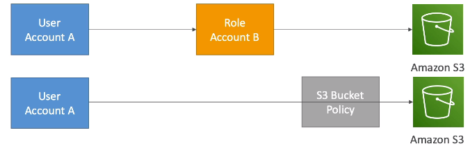

### IAM

#### Users and groups.

A user can have no group.\
A user can belong to several groups.\
A group can only contain users, not other groups.

#### Permissions and policies.

Entities (IAM identities or AWS resources) can have assigned JSON documents called policies, e.g.

```
{
    "Version": "2012-10-17",
    "Statement": [
        {
            "Effect": "Allow", // Allow or Deny
            "Principal": {} // refers to account, user or role
            "Action": [
                "dynamodb:Query",
                "dynamodb:Scan",
            ],
            "Resource": [
                "*"
            ]
        }
    ]
}
```

*Inline* policy is a policy attached directly to a user or a role.

#### Identity-based policies and resource-based policies
A policy is an object in AWS that, when associated with an identity or resource, defines their permissions.\
There are 2 types:
* **Identity-based policies** are attached to an IAM user, group, or role. 
* **Resource-based policies** are attached to a resource. For example, you can attach resource-based policies to Amazon S3 buckets, Amazon SQS queues, VPC endpoints, and AWS Key Management Service encryption keys.

#### More policy types
The following policy types, listed in order from most frequently used to less frequently used, are available for use in AWS. For more details, see the sections below for each policy type.

* **Identity-based policies** – Attach managed and inline policies to IAM identities (users, groups to which users belong, or roles). Identity-based policies grant permissions to an identity.
* **Resource-based policies** – Attach inline policies to resources. The most common examples of resource-based policies are Amazon S3 bucket policies and IAM role trust policies. Resource-based policies grant permissions to the principal that is specified in the policy. Principals can be in the same account as the resource or in other accounts.
* **Permissions boundaries** – Use a managed policy as the permissions boundary for an IAM entity (user or role). That policy defines the maximum permissions that the identity-based policies can grant to an entity, but does not grant permissions. Permissions boundaries do not define the maximum permissions that a resource-based policy can grant to an entity.
* **Organizations SCPs** – Use an AWS Organizations service control policy (SCP) to define the maximum permissions for account members of an organization or organizational unit (OU). SCPs limit permissions that identity-based policies or resource-based policies grant to entities (users or roles) within the account, but do not grant permissions.
* **Access control lists (ACLs)** – Use ACLs to control which principals in other accounts can access the resource to which the ACL is attached. ACLs are similar to resource-based policies, although they are the only policy type that does not use the JSON policy document structure. ACLs are cross-account permissions policies that grant permissions to the specified principal. ACLs cannot grant permissions to entities within the same account.
* **Session policies** – Pass advanced session policies when you use the AWS CLI or AWS API to assume a role or a federated user. Session policies limit the permissions that the role or user's identity-based policies grant to the session. Session policies limit permissions for a created session, but do not grant permissions. For more information, see Session Policies.

#### Access keys
Access keys are used to set up a CLI access or access via SDK.

* Access key id ~= username,
* Secret Access Key ~= password.

How to issue AWS CLI commands for a specific profile?

 ```
 aws ec2 describe-instances --profile user1
 ```

##### IAM Roles

Roles are used to grant permissions to services.\
Roles have attached policies.

#### Assuming IAM Roles

IAM roles allow you to delegate access to users or services that normally don't have access\
to your organization's AWS resources. IAM users or AWS services can assume a role to obtain\
temporary security credentials that can be used to make AWS API calls.\
Consequently, you don't have to share long-term credentials for access to a resource.\
Using IAM roles, it is possible to access cross-account resources.

##### IAM Access advisor. Credentials Report.

**IAM Access advisor** shows the service permissions granted to a user.\
**Credentials report** is a list of all users.\
Both can be used for permissions audit.

##### AWS Cloudshell

AWS Cloudshell is an AWS CLI running in a browser on a AWS Console site. It does not need credentials and refers to the
activated region. It also allows storing files in a working directory which persist even after session restart.

#### IAM Conditions

Can make IAM policies more granular, e.g. restrict by IP:

```json
{
  "Version": "2012-10-17",
  "Statement": [
    {
      "Effect": "Allow",
      "Principal": {},
      "Action": "*",
      "Resource": "*",
      "Condition": {
        "NotIpAddress": {
          "aws:SourceIp": [
            "192.0.2.0./24"
          ]
        }
      }
    }
  ]
}
```

Other conditions.\
Restrict the region the API calls are made to:

```json
{
  "Condition": {
    "StringEquals": {
      "aws:RequestedRegion": [
        "eu-central-1"
      ]
    }
  }
}
```

Restrict based on tags:

```json
{
  "Condition": {
    "StringEquals": {
      "ec2:ResourceTag/Project": "DataAnalytics",
      "aws:PrincipalTag/Department": "Data"
    }
  }
}
```

Force MFA:

```json
{
  "Condition": {
    "BoolIfExists": {
      "aws:MultiFactorAuthPresent": true
    }
  }
}
```

#### IAM for S3
S3 distinguishes two types of resources: a bucket itself and objects within 
```json
{
      "Action": "s3:ListBucket",
      "Resource": "arn:aws:s3:::achirkov.com"
      ----
      "Action": "s3:GetObject",
      "Resource": "arn:aws:s3:::achirkov.com/*"
}
```

#### IAM Roles vs Resource based policies
There are 2 ways of allowing access to S3 Bucket for example:
* By assuming a Role
* By defining Resource based policy on the bucket level\


Differences:
* When a user assumes a role he gives up his original permissions. Therefore, after assuming a role her is not able to make calls to other resources if they are not listed in this role. 
* When a user uses Resource based policy he does not give up his original permissions

:exclamation: Resource based policies are applied to: S3, SQS, SNS

#### IAM Permissions Boundaries
Look like IAM Roles and define maximum permissions and IAM entity can get.\
IAM Permissions Boundaries are supported for users and roles (no groups).\
A user/role can get an IAM policy that exceeds IAM Permissions Boundaries, but it will not work.

IAM Permissions Boundaries can be used in combination with AWS Organizations SCP.

Use cases: 
* Allow developers to self assign policies and manage their own permissions while making sure they can't escalate their privileges.
* Delegate responsibilities to non admins within their Permissions Boundaries for example to create new users
* Restrict one specific user instead of whole acc using Organizations SCP. 

#### Policy evaluation logic
:exclamation: Explicit denies always win.\
Session policy if for STS\

