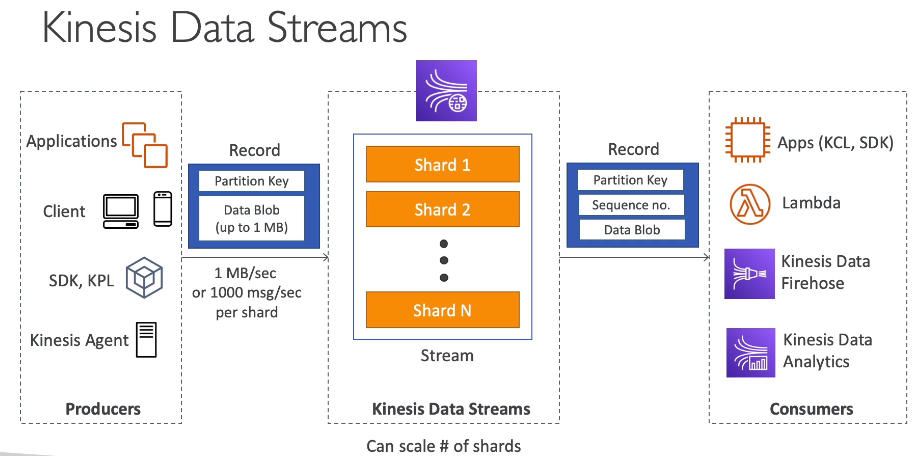
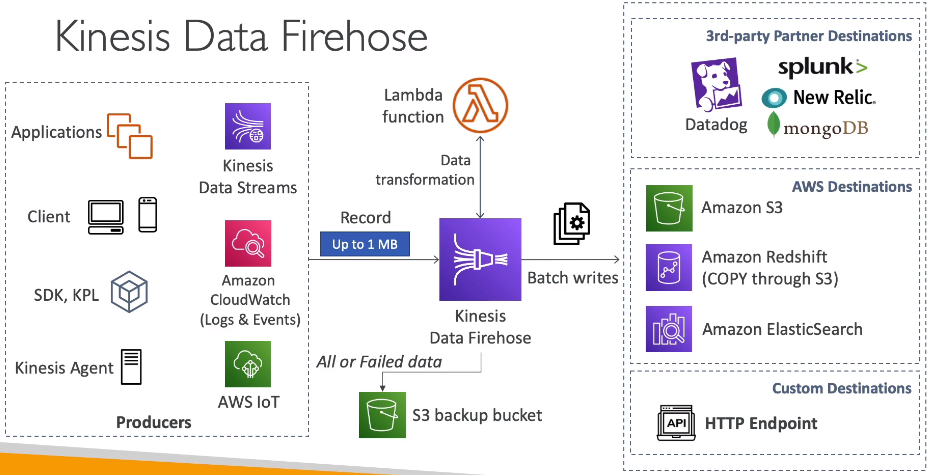

### Kinesis
* For collecting, processing and analyzing streaming data in real time.
* Ingest data such as app logs, metrics, website clickstreams, IoT telemetry.
* Subcomponents
  * Kinesis Data Streams (=Kafka under the hood): capture, process and store data streams
  * Kinesis Data Firehose: load data streams into AWS data stores
  * Kinesis Data Analytics: analyze data streams with SQL or Apache Flink
  * Kinesis Video Streams: capture, process and store video streams

#### Kinesis Data Streams
\
A stream consists of shards. More shards - more throughput.\
KCL = Kinesis Client Library.
KPL = Kinesis Producer Library.

* Billing is per shard provisioned
* Retention 1(default)..265 days => supports replay capability
* Client manages scaling (shards splitting/merging)
* Real-time, ~200ms latency
* Inserted data is immutable, can not be deleted
* Messages with the same `partition key` go to the same shard (ordering)

#### Enhanced Fanout
By default, the 2MB/second/shard output is shared between all applications consuming data from the stream.\
You should use `enhanced fan-out` if you have multiple consumers retrieving data from a stream in parallel.\
With enhanced fan-out developers can register stream consumers to use enhanced fan-out\
and receive their own 2MB/second pipe of read throughput per shard,\
and this throughput automatically scales with the number of shards in a stream.

#### Kinesis Data Firehose
* Kinesis Data Firehose is for load streaming data into S3 and other destinations.
* Kinesis Data Firehose writes to destinations in batches.
* It is near real-time system (min possible buffer time is 60 sec)
* Automatic scaling, fully manageable
* No data storage, no replay capability

#### Kinesis Data Analytics
* Perform real-time analytics on Kinesis Streams using SQL.
* KDA can not directly ingest data from the source as it ingests data either from KDS or KDF
* Fully managed, auto scaling
* Use cases
  * Time-series analytics
  * Real-time dashboards
  * Real-time metrics
