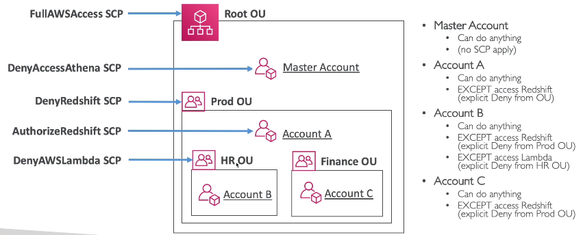

### AWS Organizations
A global service that allows to manage multiple AWS accounts.\
The main account is the **master** account - you can't change it.\
Other accounts are **member** accounts.\
A member acc can belong to one **organization** only.\
It is possible to **transfer** a member account between organizations.

Benefits:
* Consolidated billing across all accs. 
* Single payment method
* Pricing benefits from aggregated usage (volume discounts for EC2, S3...)
* API to automate AWS acc creation
* Send CloudTrail logs and CloudWatch events on all accounts to central account S3

Multi-account strategies: per department, per dev/test/prod env, based on regulatory restrictions, resources separation.

Multiple-Account vs One Account with multiple VPC:
* better separation
* excluding misconfiguration between VPCs

Member accounts can be grouped into **OU** (Organizational Unit).\
OU can be in another OU.\
OUs form a tree structure with the `Root` on top.

#### Service Control Policies (SCP)
* Whitelist or Blacklist IAM actions
* Applied to OU or Account level
* Does not apply to the master acc
* SCP are applied to all the Users and Roles of the Account, including Root.
* SCP must have an explicit `Allow` (does not allow anything by default).
* SCP are inherited from top levels and can not be overwritten,
i.e. if something is prohibited at OU level and allowed at account level, then it is prohibited.

Use cases:
* Restrict access to certain services, e.g. can't use EMR
* Enforce PCI compliance by explicitly disabling services that are not compliant yet

#### Account transfer
1. Remove the member acc from the old org.
2. Send an invite to the new org
3. Accept the invite to the new org from the member acc
