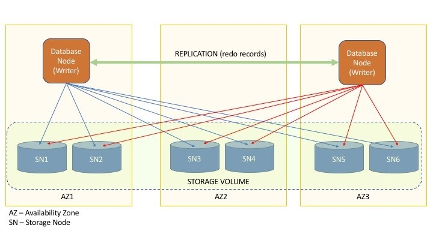

### RDS Relational Database Service
RDS supports: Postgres, MySQL, MariaDB, Oracle, Microsoft SQL Server, Aurora (AWS).

RDS is a managed service which adds on top (comparing to EC2):
* Continuous backups and restore to timestamp
* Monitoring
* Read replicas
* Automated provisioning, OS patching
* Multi AZ for disaster recovery
* Maintenance windows for upgrades
* Scaling capability (vertical and horizontal)
* Storage is backed by EBS (gp2 or io1)
* SSH not allowed

#### RDS backups
Backups are enabled by default and created automatically - daily full backup during the maintenance window.\
Transaction logs are backed up every 5 mins.\
Hence it gives ability to restore to any point in time from oldest backup (7 days retention by default, up to 35 days) to 5 mins ago.

Also there are DB Snapshots - manual backups triggered by user and can be stored longer.

#### RDS storage autoscaling
With this feature enabled RDS storage scales automatically.\
It requires to set `Maximum Storage Threshold`.

Limits:
* free storage < 10%
* lo storage state > 5 min
* 6hr has passed since last scaling

#### Read replicas
RRs can be
* within AZ
* cross AZ
* cross region

There can be up to **5** RRs.

:exclamation: RDS replication is async!

RR can be promoted to master.

An app must update connection string to leverage RRs.

In AWS there is usually a network cost for data exchange between AZs.\
For RDS replication in the same region but different AZs there is no cost.\
Cross replication is paid.

RRs can be added after DB creation.

#### RDS Multi-AZ (Disaster Recovery)
**Sync** replication between AZs.\
Master DB and stand-by replica are under one DNS name.\
RDS makes an automatic failover in case of master failure.

:exclamation: the use case for this is not scaling reads.
Stand-by database does not accept read or write requests.

Going to Multi AZ is a zero downtime op.

When upgrading a database with Multi-AZ deployment, both the primary and standby DB instances are upgraded at the same time.\
This causes downtime until the upgrade is complete.

#### Encryption
RDS can encrypt DBs at rest with KMS keys (AES-256 encryption).\
Encryption has to be defined at launch time.\
If master is not encrypted, RRs can not be encrypted.

In flight encryption is supported with TLS between clients and DBs.\
It is necessary to enforce TLS on DB side, e.g. for Postgres set `rds.force_ssl=1` parameter in RDS console.

Snapshots are encrypted/unencrypted if DB is encrypted/unencrypted correspondingly.\
It is possible to copy unencrypted snapshot to an encrypted one.

How to encrypt unencrypted DB?\
Through snapshot creation and encrypting it, then restoring DB, then migrate clients to new DB and delete old DB.

#### Network security
RDS usually are deployed to private subnets.\
Also SGs are used in RDS as well as in EC2.

To access DB itself apart from user/pass an `IAM-based auth` can be used for Postgres and MySQL.

EC2 can have IAM role and then can issue and API call to RDS to get an auth token.\
The EC2 can then use the `IAM token` to access DB.\
Pros: no user management in DB, only in IAM.

### Aurora
Aurora is a proprietary AWS DB cluster backed by Postgres or MySQL.\
Aurora is cloud optimized and outperforms plain RDS.\
Aurora scales automatically up to 128TB by 10GB increments.\
Replication lag is lower than RDS (sub 10ms) and there can be up to **15** RRs.
Aurora costs 20% more than RDS.

After cluster creation it is possible to add:
* RRs
* cross-region replicas
* replica auto-scaling
* AWS region (making global Aurora)

Aurora maintains 6 copies of data across 3 AZs.\
4/6 copies required to write, 3/6 required to read.\
Aurora supports cross region replication.

There are 2 endpoints. `Writer endpoint` refers to master.\
`Reader endpoint` connects to RRs and they are load-balanced.

Aurora can be created in 2 setups:
* `provisioned` - default, requires some prior cluster configuration
* `serverless` - automated DB scaling based on actual usage. Use case: infrequent unpredictable workloads

Aurora can be created in 2 replication setups:
* `single master`

* `multi-master` (available for MySQL). Every node is a writer.\
Writes are accepted after a positive confirmation from a quorum of storage nodes.\
Replication is peer-to-peer.\
Unlike the single master mode where a fail of writer triggers RRs promotion process,\
multi-master would require an application just to switch to another writer node\
=> **hi availability** + **hi uptime** + **immediate failover**

##### Global setup
1 primary region + up to 5 secondary RO regions with replication lag is under 1 sec.\
Up to 16 RRs per secondary region.\
Secondary region can be promoted to master in < 1 min.

Use cases: decreased latency globally, hi redundancy + hi availability.
