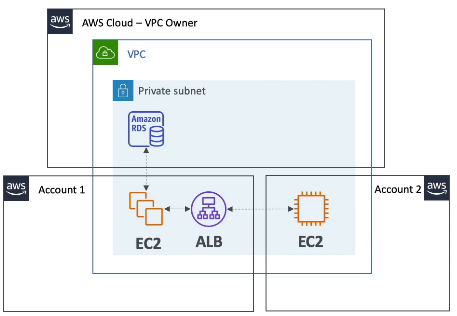

### Resources Access Manager (RAM)
Share AWS resources with other AWS accs: wihtihn Organization or any acc to avoid resource duplication.\
Resources that can be shared:
* VPC Subnets (most used)
  * allow to have all resources launched in the same subnet
  * must be from the same Organization
  * participants can manage their own resources
  * participants can not view/modify/delete resources that belong to others
  * can not share SGs and default VPC
* Transit Gateway
* Route53 Resolver Rules
* License Manager Configurations

Resources within a shared VPC can access each other using private IP.\
SGs from other accs can be references also.\
Users in different accounts still can not see resources in other accs.

