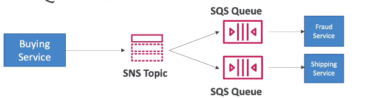

### SNS

* Pub / Sub model.
* Up to 10kk subscriptions per topic
* Up to 100k topics
* Subscribers can be:
  * SQS
  * AWS Kinesis Data Firehose
  * HTTP/HTTPS (with delivery retries - how many times)
  * Lambda
  * Emails
  * SMS
  * Mobile notifications
* **at least once delivery**
* **best effort ordering**

#### How to publish
1. Topic publish (using SDK)
2. Direct publish (for mobile apps SDK)

#### Security
Encryption:
* encryption in flight with HTTPS API
* encryption at rest with KMS
* client-side encryption is possible

Access control:
* IAM policies to regulate access to SNS API
* SNS Access policies (similar to S3 access policies). Useful for
  * cross-account access to SNS topics.
  * allowing other services to write to an SNS topic

#### SNS + SQS Fan Out Pattern
Need to send a message to multiple services, hence queues.\
We can push once to SNS and subscribe all SQS queues to the topic.
* Ability to add more SQS subscriberes in future
* Need to allow SQS policies for SNS to write

#### FIFO topic
* Messages are ordered based on `message group ID`.
* Deduplication using either "content based deduplication" or "deduplication ID" token
* :exclamation: Can only have SQS FIFO queues as subscribers
* Limited throughput (same as for SQS FIFO because only them can subscribe)

#### Message Filtering
* A JSON policy used to filter messages sent to subscriptions
* If a subscription has no policy, it retrieves all messages
