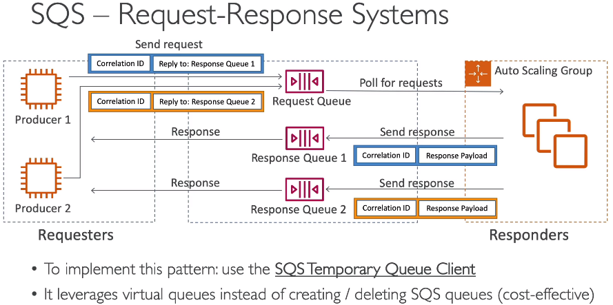

### SQS

Use case: decouple applications, works as a buffer.\
Features:
* Unlimited throughput, unlimited number of messages
* Default retention period for messages - 4 days, maximum - 14 days.
* Lo latency (<10ms to publish and receive)
* Messages have to be small <256 KB
* **Can have duplicate messages (=at least once delivery semantics)**
* **Can have out of order messages (=best effort ordering)**
* Consumers poll for messages and can fetch up to 10 messages at a time.
* Consumers have to delete messages after processing

It is possible to set up an ASG that will be triggered by CloudWatch metric "Queue Length" and will scale out EC2s.

#### Security
Encryption:
* encryption in flight with HTTPS API
* encryption at rest with KMS
* client-side encryption is possible

Access control:
* IAM policies to regulate access to SQS API
* SQS Access policies (similar to S3 access policies). Useful for
  * cross-account access to SQS queues.
  * allowing other services (SNS, S3...) to write to an SQS queue

#### Visibility timeout
After a message is polled by a consumer, the message becomes invisible to other consumers.\
By default, this timeout is 30 seconds and can be set up to 12 hours in queue settings.\
This means that the consumer has 30 seconds to process the message.\
If the message is not processed/deleted within the visibility timeout, it can be picked up by another consumer.\
The processing consumer can call the `ChangeMessageVisibility` API to get more time programatically.

#### FIFO queues
* Messages are ordered based on `message group ID`.
* As a downside, throughput is limited to 300 msg/s without batching, 3000 msg/s with batching.
* Exactly-once send capability
* Deduplication using either "content based deduplication" or "deduplication ID" token

:exclamation: You can't convert an existing standard queue into a FIFO queue. To make the move, you must either create a new FIFO queue for your application or delete your existing standard queue and recreate it as a FIFO queue.

#### Dead letter queues
Something wrong can be with a message - it can cause a consumers to fail.\
After the `MaximumReceives` threshold is exceeded, the message goes into a DLQ.\
Messages in DLQ can be later investigated.\
DLQ also has a retention period and it is important to fetch messages from it within this period.\
A DLQ and the `MaximumReceives` are specified in the settings of a target queue.

#### Delivery delay
1. **Delay queues** let you postpone the delivery of new messages.\
Consumers do not see messages in a delay queue immediately.\
Delay can be up to 15 mins.\
By default, it is 0 sec.\
The delay can be set at a queue level or overridden with API when a producer sends a message.

2. You can use message timers to set an initial invisibility period for a message added to a queue.\
So, if you send a message with a 60-second timer, the message isn't visible to consumers for its first 60 seconds in the queue.\
The default (minimum) delay for a message is 0 seconds. The maximum is 15 minutes.\
You should use message timers to postpone the delivery of **certain messages** to the queue by one minute.\
:exclamation: FIFO queues don't support timers on individual messages!\
To set a delay period on an entire queue, rather than on individual messages, use delay queues.

#### Long polling
Long polling can be enabled and configured up to 20 seconds.\
Long polling decreases number of API calls.
Long polling can be configured at queue level or using the `WaitTimeSeconds` in API.

#### SQS Requst-Response systems
It is possible to set up a request-response communication model with 2 queues between 2 services.\
To make it working it is necessary to embed correlation_id into messages.\
With Java SDK there is no need to implement the pattern manually, it is done in the "SQS Temporary Queue Client"

#### VPC Access
Clients can access SQS from their VPC using `VPC endpoints`, without using public IPs, and without needing to traverse the public internet.  

#### Temporary Queues
Temporary queues help you save development time and deployment costs when using common message patterns such as request-response.\
You can use the **Temporary Queue Client** to create high-throughput, cost-effective, application-managed temporary queues.

The client maps multiple temporary queues—application-managed queues created on demand for a particular process—onto a single Amazon SQS queue automatically.\
This allows your application to make fewer API calls and have a higher throughput when the traffic to each temporary queue is low. When a temporary queue is no longer in use, the client cleans up the temporary queue automatically, even if some processes that use the client aren't shut down cleanly.

The following are the benefits of temporary queues:
* They serve as lightweight communication channels for specific threads or processes.
* They can be created and deleted without incurring additional costs.

They are API-compatible with static (normal) Amazon SQS queues.\
This means that existing code that sends and receives messages can send messages to and receive messages from virtual queues.
