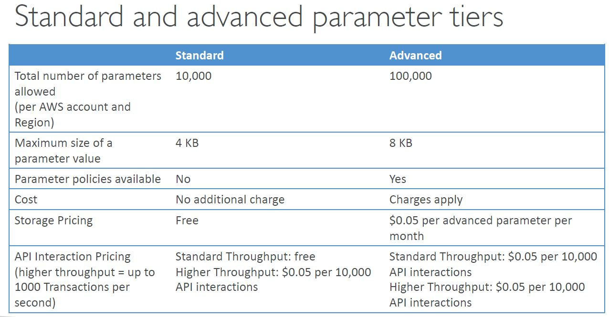

### SSM Parameter Store
* Secure storage for configuration and secrets
* Optional seamless encryption using KMS
* Serverless, scalable
* Versioning
* Configuration management using path & IAM
* Notifications with CloudWatch Events
* Integration with CloudFormation

There are 2 tiers, free and advanced (paid).


Parameter policy can for instance be expiration date to force updating passwords.

#### Access
:exclamation: a service for example needs an access both for SSM GetParameter/GetParameterByPath
and for KMS CMK to decrypt the value in case the parameter is encrypted.  

#### CLI examples
```shell
# GET PARAMETERS
aws ssm get-parameters --names /my-app/dev/db-url /my-app/dev/db-password
# GET PARAMETERS WITH DECRYPTION
aws ssm get-parameters --names /my-app/dev/db-url /my-app/dev/db-password --with-decryption

# GET PARAMETERS BY PATH
aws ssm get-parameters-by-path --path /my-app/dev/
# GET PARAMETERS BY PATH RECURSIVE
aws ssm get-parameters-by-path --path /my-app/ --recursive
# GET PARAMETERS BY PATH WITH DECRYPTION
aws ssm get-parameters-by-path --path /my-app/ --recursive --with-decryption
```
