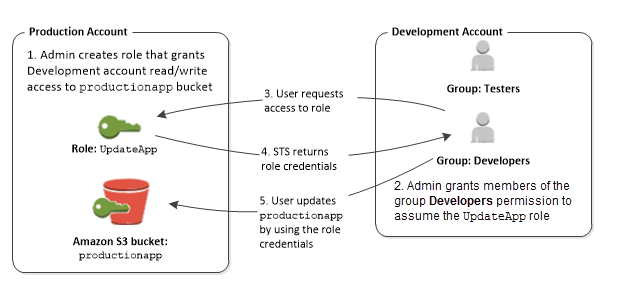

### STS Security Token Service
Grants limited temporary access to AWS resources.\
Token is valid for up to 1hr.

#### Using STS to assume a role
 * AssumeRole
   * within own account for enhanced security
   * cross account - to assume role in target account to perform actions there
 * AssumeRoleWithSAML
   * returns creds for users logged with SAML
 * AssumeRoleWithWebIdentity
     * returns creds for users logged with IdP (Facebook, Google, OIDC compatible)
     * AWS recommends using Cognito instead for this use case
 * GetSessionToken
   * for MFA from a user or AWS account root user

How does it work:
* Define an IAM role in a target account.
* Define which principals can access this IAM Role from accessing account
* Users use AWS STS to retrieve creds and impersonate the Role (AssumeRole API)
* Temp creds can be valid between 15 min to 1 hr

