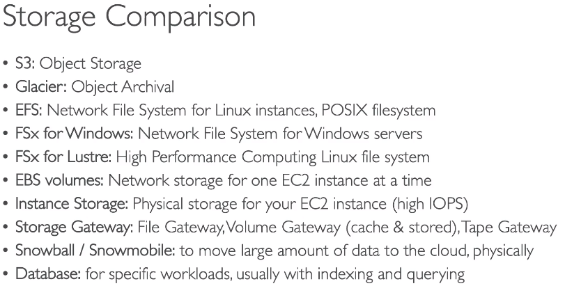
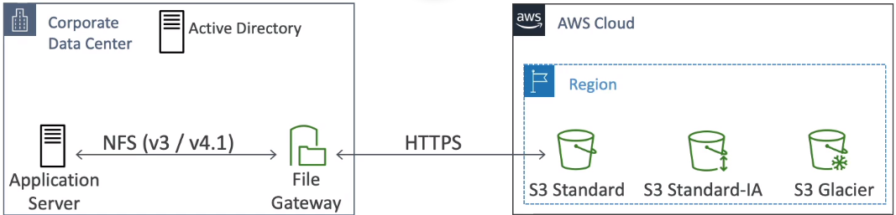
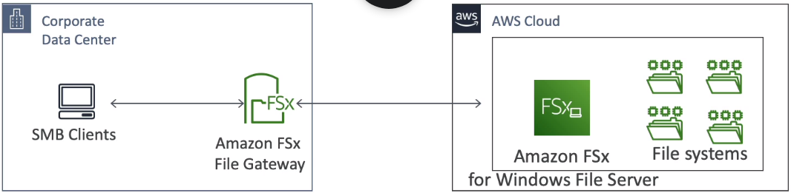
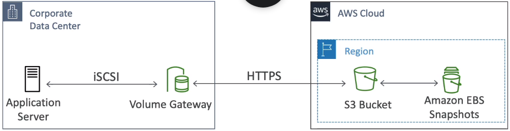

### AWS Snow Family

Highly secure portable devices to collect and process data at the edge and migrate data in and out of AWS.\
AWS send a device to a customer.\
Use cases:
* large data to S3 migrations when transfer time > 1 week.
* export from S3
* edge computing

Data migration:
* Snowball Edge - big device with storage onboard.
  * SE Storage optimized - 80TB block volume.
  * SE Compute optimized - 42TB block volume.
* Snowcone - a smaller device, light and withstands harsh environments. 8TB storage.
* Snowmobile - an actual truck which carries up to 100PB and grants additional security.

A device can be ordered in the AWS Console.

2nd use case - processing data directly at edge locations where no internet connectivity is available, e.g. ship, mining station etc.
Edge computing:
* Snowcone - 2CPUs, 4GB of RAM, wired or wireless access, USB-C power.
* Snowball Edge
  * SE Storage optimized - 40vCPU, 80 GB RAM, optional GPU, 42TB storage.
  * SE Compute optimized - 52vCPU, 208 GB RAM, optional GPU, 42TB storage.

All devices can run EC2 or Lambda.\
Devices can be unavailable in certain regions.\
Long term deployment options offer 1 and 3 years discounted prices.

Devices are controlled via CLI.\
Also AWS offers an `OpsHub` service to manage devices via GUI. OpsHub is installed to client's machine.

#### Snow to Glacier
Snowball can not transfer directly to Glacier.\
To do so it is possible to transfer to S3 and set up lifecycle rules.

### FSx
Use case: launch a hi perf 3rd party distributed file system on AWS (instead of EFS).\
:exclamation: EFS is a shared POSIX system meaning that it is for Unix machines.\
FSx is a fully managed service that supports:
* FSx for Lustre. Use case: parallel distributed FS for large scale computing, machine learning, HPC on Linux.\
Has seamless integration with S3 - can read S3 as FS and can write directly to S3 through FS.\
Has hi throughput, lo latency.\
FSx for Lustre provides the ability to both process the 'hot data' in a parallel and distributed fashion as well as  store the 'cold data' on S3.
* FSx for Windows File Server.
* FSx for NetApp ONTAP

FSx supports Multi-AZ.\
Data is backed up daily to S3.\
FSx can be backed either by SSD or HDD.

Deplyment options:
* Scratch file system. For temporary storage, not replication, hi burst (6x faster). Use case: short term processing data, optimizing costs.
* Persistent file system. Long term storage. Replication within same AZ. Use case: long-term processing, sensitive data.

### Storage Gateway
AWS is pushing for hybrid cloud model.\
It means that part of client's infrastructure can go to cloud and part stay on-premises.\
S3 is a proprietary storage technology, so how to expose S3 data on premises?\
AWS Storage Gateway is a bridge between on-premises and cloud data in S3.\
A Gateway has to be installed in on-premise datacenter of the client and requires virtualization.

#### Types of Storage Gateway
1. **File Gateway**
* Configured S3 buckets are accessible using NFS protocol
* Supports S3 standard, S3 IA, S3 One-Zone IA
* Bucket access using IAM roles for each FG
* **Most recent data is cached in the File Gateway**
* Can be mounted on many servers
* **Integrates with Active Directory for user authentication**

2. **FSx File Gateway**
* Gives native access to AWS FSx for Windows File Server
* Most recent data is cached in the File Gateway
* Windows native compatibility (SMB, NTFS, Active Directory)

3. **Volume Gateway**
* Block storage using iSCSI proto backed by S3
* **Backed up by EBS snapshots which can restore client's on-premises volumes.**
* Types:
  * **Cached Volumes**: With cached volumes, the AWS Volume Gateway stores the full volume in its Amazon S3 service bucket\
  and just the recently accessed data is retained in the gateway’s local cache for low-latency access.
  * **Stored Volumes**: With stored volumes, your entire data volume is available locally in the gateway, for fast read access.\
  Volume Gateway also maintains an asynchronous copy of your stored volume in the service’s Amazon S3 bucket.

Use case: backup volumes on on-premises servers.

4. **Tape Gateway**
* For companies that have backup process using physical tapes

5. **Storage Gateway - Hardware Appliance**
Sometimes a client has no ability to run a virtual server with Storage Gateway on it.\
Then he can use a physical device from AWS (=miniserver).

### Transfer Family
A managed service for file transfer in and out of S3 or EFS using the FTP proto.\
Supported protos: FTP, FTPS, SFTP.\
Service can store and manage credentials or can also integrate with auth systems (Active Directory, Okta, Cognito, custom...).\
The service is accessed via an FTP endpoint or DNS in Route53.

Use case: setting up FTP interface to S3 when the company relies on FTP already. 

### DataSync
AWS DataSync is an online data transfer service that simplifies, automates, and accelerates copying large amounts\
of data to and from AWS storage services over the internet or AWS Direct Connect.

AWS DataSync fully automates and accelerates moving large active datasets to AWS, up to 10 times faster than\
command-line tools. It is natively integrated with:
* Amazon S3
* Amazon EFS
* Amazon FSx for Windows File Server
* Amazon CloudWatch
* AWS CloudTrail

DataSync uses a purpose-built network protocol and scale-out architecture to transfer data.\
A single DataSync agent is capable of saturating a 10 Gbps network link.

DataSync fully automates the data transfer.\
It comes with retry and network resiliency mechanisms, network optimizations, built-in task scheduling, monitoring via\
the DataSync API and Console, and CloudWatch metrics, events, and logs that provide granular visibility into the transfer process.\
DataSync performs data integrity verification both during the transfer and at the end of the transfer.

To make it work it is necessary to install a DataSync agent in client's DC.\
Replication tasks can be scheduled hourly/daily/weekly.

DataSync can establish replication between:
* DC and AWS
* 2 AWS accounts in different regions

#### DataSync vs File Gateway
AWS recommends that you should use AWS DataSync to migrate existing data to Amazon S3, and subsequently\
use the File Gateway configuration of AWS Storage Gateway to retain access to the migrated data and for ongoing updates\
from your on-premises file-based applications.
