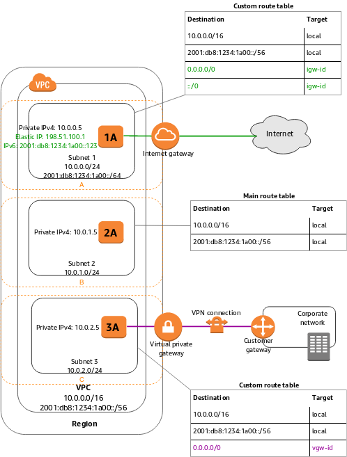

### VPC

VPC has its range of IPv4 addresses, e.g. `10.0.0.0/16`

A VPC is a regional network that can include subnets in different AZs in the region.\
After you create a VPC, you can add one or more subnets in each Availability Zone.\
VPC cannot span across multiple regions.

A subnet is a range of IP addresses in your VPC.
Subnet types:
* Public subnet: The subnet's IPv4 or IPv6 traffic is routed to an internet gateway and can reach the public internet.
* Private subnet: The subnet’s IPv4 or IPv6 traffic is not routed to an internet gateway and cannot reach the public internet.
* VPN-only subnet: The subnet doesn't have a route to the internet gateway, but it has its traffic routed to a virtual private gateway for a Site-to-Site VPN connection

Note the following:

* 1A, 2A, and 3A represent instances in your VPC.
* Subnet 1 is a public subnet, subnet 2 is a private subnet, and subnet 3 is a VPN-only subnet.
* An internet gateway enables communication over the internet, and a virtual private network (VPN) connection enables communication with your corporate network.

Each subnet must be associated with a route table, which specifies the allowed routes for outbound traffic leaving the subnet.

The route table associated with subnet 1 routes all IPv4 traffic (`0.0.0.0/0`) and IPv6 traffic (`::/0`) to an internet gateway (for example, `igw-1a2b3c4d`). Because instance 1A has an IPv4 Elastic IP address and an IPv6 address, it can be reached from the internet over both IPv4 and IPv6.

The instance 2A can't reach the internet, but can reach other instances in the VPC. You can allow an instance in your VPC to initiate outbound connections to the internet over IPv4 but prevent unsolicited inbound connections from the internet using a network address translation (NAT) gateway or instance.

The route table associated with subnet 3 routes all IPv4 traffic (`0.0.0.0/0`) to a virtual private gateway (for example, `vgw-1a2b3c4d`). Instance 3A can reach computers in the corporate network over the Site-to-Site VPN connection.
