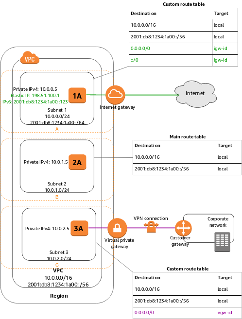
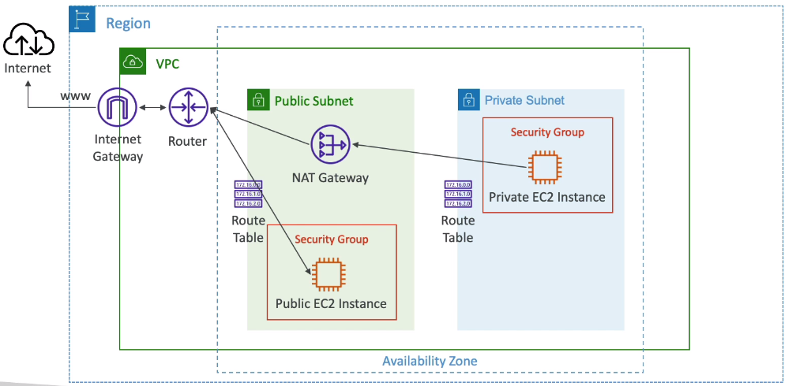
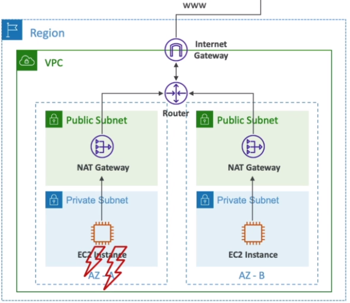
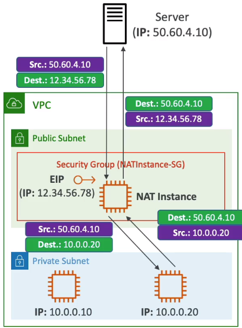
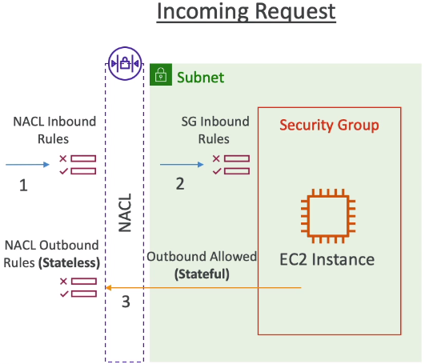
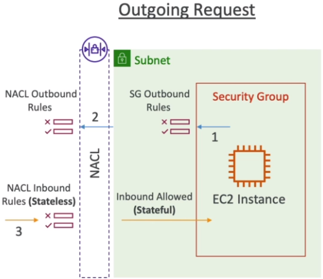
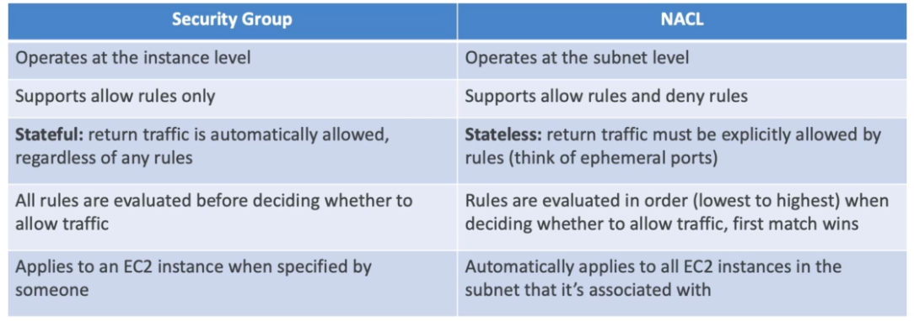
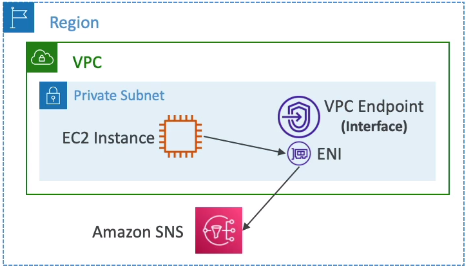
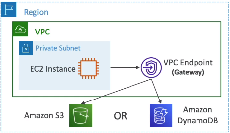

### VPC

VPC has its range of IPv4 addresses, e.g. `10.0.0.0/16`

A VPC is a regional network that can include subnets in different AZs in the region.\
After you create a VPC, you can add one or more subnets in each Availability Zone.\
VPC can not span across multiple regions.

Max CIDR per VPC is 5, for each CIDR:
* min size is /28 (16 IP addresses)
* max size is /16 (65536 IP addresses)

:exclamation: VPC CIDR should not overlap with your other Networks (e.g., corporate)\
:exclamation: 5 addresses in each CIDR/subnet are always reserved by AWS. Hence, `/27` gives not 32 IP addresses, but 32-5 = 27

A subnet is a range of IP addresses in your VPC.
Subnet types:
* Public subnet: The subnet's IPv4 or IPv6 traffic is routed to an internet gateway and can reach the public internet.
* Private subnet: The subnet’s IPv4 or IPv6 traffic is not routed to an internet gateway and cannot reach the public internet.
* VPN-only subnet: The subnet doesn't have a route to the internet gateway, but it has its traffic routed to a virtual private gateway for a Site-to-Site VPN connection

Note the following:

* 1A, 2A, and 3A represent instances in your VPC.
* Subnet 1 is a public subnet, subnet 2 is a private subnet, and subnet 3 is a VPN-only subnet.
* An internet gateway enables communication over the internet, and a virtual private network (VPN) connection enables communication with your corporate network.

Each subnet must be associated with a route table, which specifies the allowed routes for outbound traffic leaving the subnet.

The route table associated with subnet 1 routes all IPv4 traffic (`0.0.0.0/0`) and IPv6 traffic (`::/0`) to an internet gateway (for example, `igw-1a2b3c4d`).\
Because instance 1A has an IPv4 Elastic IP address and an IPv6 address, it can be reached from the internet over both IPv4 and IPv6.

The instance 2A can't reach the internet, but can reach other instances in the VPC.\
You can allow an instance in your VPC to initiate outbound connections to the internet
over IPv4 but prevent unsolicited inbound connections from the internet using a network
address translation (NAT) gateway or a NAT instance.

The route table associated with subnet 3 routes all IPv4 traffic (`0.0.0.0/0`) to a virtual private gateway (for example, `vgw-1a2b3c4d`).\
Instance 3A can reach computers in the corporate network over the Site-to-Site VPN connection.

#### IGW Internet Gateway
Enables resources **with public IPs** in VPC connect to the Internet.
* Must be created separately from VPC
* One VPC can only be attached to one IGW and vice versa
* IGW on its own does not allow Internet access - Route Tables associate with subnets also must be edited!

#### NAT Gateway
A NAT gateway is a Network Address Translation (NAT) service.\
You can use a NATGW so that instances in a private subnet can connect to services outside your VPC but external services cannot initiate a connection with those instances.

* When you create a NATGW, you specify one of the following connectivity types:
  * **Public** – (Default) Instances in private subnets can connect to the internet through a public NAT gateway, but cannot receive unsolicited inbound connections from the internet.
  You create a public NAT gateway in a **public subnet** and must associate an **elastic IP** address with the NAT gateway at creation.
  * **Private** – Instances in private subnets can connect to other VPCs or your on-premises network through a private NAT gateway. 
* AWS Managed (unlike NAT Instance). No administration. Supersedes NAT Instances.
* Paid per hour of usage
* NATGW is created in a specific AZ
* Can't be used by EC2 instances in the same subnet (only from other subnets)
* Requires an IGW (Private Subnet -> NATGW -> IGW)
* Bandwidth is 5 Gbps with aut scaling up to 45 Gbps
* No need to manages SGs! (unlike NAT Instances)

NATGW is resilient within a single AZ only.\
To achieve fault tolerance and hi availability it is necessary to create multiple NATGWs in multiple AZs

#### NAT Instance
NAT = Network Address Translation
Allows EC2 in private subnet ot connect to the Internet.\
:exclamation: NAT Instances are superseded by the NAT Gateway!\
* Must be launched in a public subnet
* Must disable EC2 setting: `Source destication check`
* Must have **Elastic IP** attached
* Must manage SGs on NAT Instance
* Need to use special pre-configured AMIs
* Can be used as a Bastion host

NAT Instances re-writes network packets changing source IP.

#### Bastion host
How to give access to EC2 hosts in a **private subnet**?\
There is a concept of **bastion host** - an EC2 host placed in a public subnet and open to the Internet.\
Users can ssh into bastion host first then ssh from bastion host to target hosts in the private subnet (2 hops).

#### VPC Sharing
Use VPC sharing to share **one or more subnets** with other AWS accounts belonging\
to the same parent organization from AWS Organizations.\
The owner account **cannot share the VPC itself**.

VPC sharing (part of Resource Access Manager) allows multiple AWS accounts to create their\
application resources such as EC2 instances, RDS databases, Redshift clusters, and Lambda functions,\
into shared and centrally-managed Amazon Virtual Private Clouds (VPCs).\
To set this up, the account that owns the VPC (owner) shares one or more subnets with\
other accounts (participants) that belong to the same organization from AWS Organizations.

After a subnet is shared, the participants can view, create, modify, and delete their\
application resources in the subnets shared with them.\
Participants cannot view, modify, or delete resources that belong to other participants or the VPC owner.

#### VPC Peering
A VPC peering connection is a networking connection between two VPCs that enables you\
to route traffic between them using private IPv4 addresses or IPv6 addresses.\
Instances in either VPC can communicate with each other as if they are within the same network.\
Unlike VPC sharing VPC peering does not facilitate centrally managed VPCs.

* Can be cross account and cross regions
* Must not have overlapping CIDRs
* VPC Peering is not **transitive**, i.e. peering VPC_A <-> VPC_B <-> VPC_C does not make VPC_A <-> VPC_C
* Must update Route Tables in each VPC's subnets to ensure EC2s can communicate
  * Destination = another VPC CIDR
  * Target = "peering connection"

#### NACLs vs SGs
Network Access Control List (NACL) = firewall at subnet level.
* New subnets are assigned the **Default NACL**.
  * :exclamation: Default NACL allows all traffic in and all traffic out
* NACL Rules are stateless, i.e. inbound and unbound rules are evaluated independently.
  * Rules have a number (1-32766). Higher precedence with a lower number.
  * First rules match will drive the decision
  * The last rule is an asterisk and denies a request in case of no rule match
* NACL must deal with **Ephemeral ports** (short lived random ports that a client opens and holds to get a response from a server)

Use case: blocking specific IPs at the subnet level.\

#### VPC Reachability Analyzer
A tool to check connectivity between two endpoints in VPC.\
It will check NACLs, SGs, Route tables, ENIs and so on without sending actual network packets.\
It is a paid per analysis service.

Use case: troubleshooting connectivity in case of complex network topology

#### VPC Endpoints (AWS PrivateLink)
How to enable hosts in private subnets to access AWS services like S3?\
It is possible to establish EC2 -> NATGW -> IGW -> S3 connection but it is not optimal because it is routed through the Internet.

Instead, a VPC Endpoint can be used.\
A VPC endpoint enables connections between a virtual private cloud (VPC) and supported services, without requiring that you use an internet gateway, NAT device, VPN connection, or AWS Direct Connect connection.\
**AWS PrivateLink** is a highly available, scalable technology that enables you to privately connect your VPC to supported AWS services

Types of VPC Endpoints:
* **Interface endpoint**. Provisions an ENI (private IP) as an entry point (must attach SG). Support most AWS services

* **Gateway endpoint**. Provisions a gateway and must be used as a target in a route table. Supports S3 and Dynamodb

#### VPN CloudHub
// TODO
