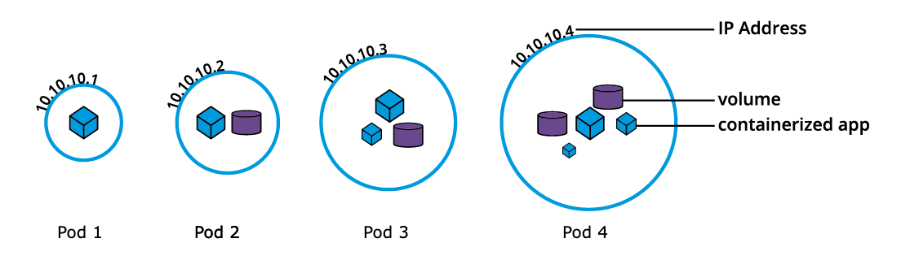

### Kubernetes concepts
https://kubernetes.io/docs/concepts/overview/

Kubernetes provides:
* Service discovery and load balancing
* Automated rollouts and rollbacks
* Secret and configuration management 
* Storage orchestration

#### Kubernetes cluster components:
* **Control Plane**. It makes global decisions about the cluster (for example, scheduling), as well as detecting and responding to cluster events (for example, starting up a new pod when a deployment's replicas field is unsatisfied). Sub-components:
  * kube-apiserver
  * etcd (backing store for all cluster data)
  * kube-scheduler (assigns workloads to nodes)
  * Controller
  * and others...
* **Worker Node**. Runs pods. Sub-components:
  * Container runtime. Can be different: containerd, docker engine, CRI-O...
  * kubelet. An agent watching for Pods.
  * kube-proxy. Maintains network rules on nodes.

What is the difference between **pod** and **worker node**?\
Pods are simply the smallest unit of execution in Kubernetes, consisting of one or more containers.\
Nodes are the physical servers or VMs that comprise a Kubernetes Cluster.

#### Tools to deploy a cluster:
* Minikube. Supports isolation methods like virtualization or container runtimes 
* kubeadm
* others...

#### Minikube 
https://minikube.sigs.k8s.io/docs/start/

```
minikube start
minikube status
minikube profile list
minikube dashboard
minikube stop
minikube kubectl -- {kubectl command}
```

#### Kubectl commands
* `kubectl config view` to view cluster config at ` ~/.kube/config`
* `kubectl cluster-info`
* `kubectl proxy --port=8080` to expose the cluster's API on the `localhost` without the need to authenticate. Otherwise, need to generate an API token and call the API server's IP.
* `kubectl run hello-minikube --image ...` deploys an app onto cluster
* `kubectl get nodes` list all nodes
* `kubectl create -f definition.yaml` creates a pod from a file
* `kubectl get pods` list all pods
* `kubectl describe pod myapp-pod` list pod info

### Terms
#### Namespaces 
Namespaces partition the cluster into virtual sub-clusters.\
The names of the objects inside a Namespace are unique, but not across Namespaces in the cluster.\
Namespaces provide a solution to multi-tenancy.\
**Resource quotas** help users limit the overall resources consumed within Namespaces.

```
kubectl get namespaces
```

#### Pods
Pods is the smallest Kubernetes workload object.\
It is the unit of deployment in Kubernetes, which represents a single instance of the application.\
A Pod is a logical collection of one or more **different** containers having the same IP.
```
kubectl get pods -A
```


Example of a stand-alone Pod object's definition without an operator:
```
apiVersion: v1
kind: Pod
metadata:
  name: nginx-pod
  labels:
    app: myapp
    type: front-end
spec:
  containers:
  - name: nginx
    image: nginx:1.22.1
    ports:
    - containerPort: 80
```

### Workloads
#### Deployment
User describes a desired state of pods in a Deployment and Deployment Controller checks on the health of pods and restarts the container if necessary.\
A deployment can be created like:
```
kubectl create deployment hello-minikube --image=kicbase/echo-server:1.0
```
or from a file:
```
kubectl apply -f nginx-deployment.yaml
```
List deployments:
```
kubectl get deployments
```


<br><br>
#### Docker runtime vs containerd
Initially Kubernetes worked with Docker directly.\
Then an CRI interface was developed to support other runtimes.\
CRI was not supported by Docker and Kubernetes used Docker via temporary "dockershim".\
At the same time `containerd` was developed as a CRI compatible sub-component of Docker.\
Since v1.24 Kubernetes removed "dockershim".\
It is possible to install `containerd` only (without docker) and run containers (but not convenient).\
Now docker runtime works via `cri-dockerd` container runtime endpoint.
