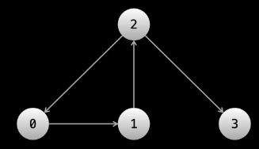

## LeetCode refcards

### Strings and arrays
Tips:
* Two pointers
* Sliding window
```
public int fn(int[] arr) {
    int left = 0, ans = 0, curr = 0;

    for (int right = 0; right < arr.length; right++) {
        // do logic here to add arr[right] to curr

        while (WINDOW_CONDITION_BROKEN) {
            // remove arr[left] from curr
            left++;
        }

        // update ans
    }

    return ans;
}
```
* Build a "prefix sum" aux array to quickly get sum of subarrays from `i` to `j` as `prefix[j] - prefix[i - 1]`

### Trees
Inorder recursive DFS:
```
public void dfs(Node node) {
    if (node == null) {
        return;
    }

    dfs(node.left);
    System.out.println(node.val);
    dfs(node.right);
}
```
Iterative DFS:
```
Stack<TreeNode> stack = new Stack<>();
stack.push(node);

while(!stack.isEmpty()) {
    final TreeNode curr = stack.pop();
    System.out.print(curr.val);
    if (curr.right != null) {
        stack.push(curr.right);
    }
    if (curr.left != null) {
        stack.push(curr.left);
    }
}
```
BFS:
```
Queue<TreeNode> queue = new LinkedList<>();
queue.add(root);

while(!queue.isEmpty()) {
    final int size = queue.size();
    for (int i = 0; i < size; i++) {
        final TreeNode node = queue.poll();
        if (node.left != null) {
            queue.add(node.left);
        }
        if (node.right != null) {
            queue.add(node.right);
        }
    }
}
```

### Graphs
#### Representation

1. Adjacency list 
   1. A 2D integer array, e.g. `graph = [[1], [2], [0, 3], []]`
   2. Map of node to adjacent nodes
2. Array of edges, e.g. `edges = [[0, 1], [1, 2], [2, 0], [2, 3]]`
3. Adjacency matrix - 2D matrix where `graph[i][j] == 1` means there is an outgoing edge from node i to node j

#### Traversing.
For graphs (unlike trees) it is important to avoid loops.\
A set or a boolean[] array can be used for this.

DFS:
```
Map<Integer, List<Integer>> graph = new HashMap<>();
boolean[] seen;

  public void dfs(int node) {
  for (int neighbor: graph.get(node)) {
      if (!seen[neighbor]) {
          seen[neighbor] = true;
          dfs(neighbor);
      }
  }
}

```
Iterative DFS:
```
public void dfs(int start) {
    Stack<Integer> stack = new Stack<>();
    stack.push(start);
    while (!stack.empty()) {
        int node = stack.pop();
        for (int neighbor: graph.get(node)) {
            if (!seen.contains(neighbor)) {
                seen.add(neighbor);
                stack.push(neighbor);
            }
        }
    }
}

```
BFS:
```
Queue<TreeNode> queue = new LinkedList<>();
Set<TreeNode> seen = new HashSet<>();
        
while (!queue.isEmpty()) {
   int currentLength = queue.size();
   for (int i = 0; i < currentLength; i++) {
       TreeNode node = queue.remove();
       for (TreeNode neighbor: ...) {
           if (!seen.contains(neighbor)) {
               seen.add(neighbor);
               queue.add(neighbor);
           }
       }
   }
}

```

Tips:
* For chessfield-like graphs use directions to simplify getting neighbours:\
`int[][] directions = new int[][]{{-1, 0}, {0, -1}, {0, 1}, {1, 0}};` 

### Linked Lists

Tips:
* Fast and slow pointers
* Reversing a list

### Backtracking 

Backtracking is a general type of algorithm that is an optimization on exhaustive search.\
The most common type of problem that can be solved with backtracking is "find all possible ways to do something".

Instead of generating all candidates and checking them, backtracking abandons a path once it can no longer lead to answers.
Abandoning a path is also sometimes called "pruning".

Backtracking algorithms typically have a exponential time complexity or worse.

Example:
```
public List permutations(int[] nums) {
    List<List<Integer>> ans = new ArrayList<>();
    List<List<Integer>> current_state = new ArrayList<>();
    backtrack(current_state, ans, nums);
    return ans;
}

public void backtrack(List<Integer> curr, List<List<Integer>> ans, int[] nums) {
    // Check for criteris when to accept the leaf or abandon the branch
    if (curr.size() == nums.length) {
        ans.add(new ArrayList<>(curr)); // mind the cope constructor
        return;
    }
    
    // Iterate over possible options. Dont forget to prune as much as possible!
    for (int num: nums) {
        if (!curr.contains(num)) {
            curr.add(num);
            backtrack(curr, ans, nums);
            curr.remove(curr.size() - 1);
        }
    }
}
```
Tip:\
To avoid duplicates, for example [2, 2, 3] and [2, 3, 2], pass an integer variable that indicates where to start iterating (this is a very common trick used in backtracking).

### Dynamic programming

DP is optimized recursion.

We define some recursive function `dp`, that returns the answer to the original problem as if the arguments passed to it were the input.
The arguments that a recursive function takes is called a `state`.

To avoid repeating computation, we use something called `memoization`.

#### When should I consider using DP?
There are two main characteristics that problems which can be solved with DP have:

1. The problem will be asking for an optimal value (max or min), or the number of ways to do something.
* What is the minimum cost of doing ...
* What is the maximum profit of ...
* How many ways are there to ...
* What is the longest possible ...
2. At each step, you need to make a "decision", and **decisions affect future decisions**.
* A decision could be picking between two elements
* Decisions affecting future decisions could be something like "if you take this element, then you can't take that element in the future"

#### Top down vs. bottom up
Top down is implemented using recursion and a hash map/array for memoization.\
Bottom up is done iteratively and using an array. 

#### Framework for DP
1. A function `dp` that will compute/contain the answer to the problem for any given state
2. A recurrence relation to transition between states, e.g. `dp(i) = min(dp(i - 1) , dp(i - 2))`
3. Base cases

"House robber" example top-down:
```
    Map<Integer, Integer> memo = new HashMap<>();
    
    public int rob(int[] nums) {
        return dp(nums.length - 1, nums);
    }
    
    public int dp(int i, int[] nums) {
        // Base cases
        if (i == 0) {
            return nums[0];
        }
        if (i == 1) {
            return Math.max(nums[0], nums[1]);
        }
        
        if (memo.containsKey(i)) {
            return memo.get(i);
        }
        
        // Recurrence relation
        memo.put(i, Math.max(dp(i - 1, nums), dp(i - 2, nums) + nums[i]));
        return memo.get(i);
    }
```
"House robber" example bottom-up:
```
    public int rob(int[] nums) {
        int n = nums.length;
        int[] dp = new int[n];
        
        // Base cases
        dp[0] = nums[0];
        dp[1] = Math.max(nums[0], nums[1]);
        
        for (int i = 2; i < n; i++) {
            // Recurrence relation
            dp[i] = Math.max(dp[i - 1], dp[i - 2] + nums[i]);
        }
        
        return dp[n - 1];
    }
```
#### Improving the space complexity
Often there is no need to keep all states during memoization - only last 1 or 2 states are enough.

### Stack and Queues
Tips:
* **Monotonic** stacks or queues are useful in problems that, for each element, involves finding the "next" element based on some criteria, for example, the next greater element.
```
    while (stack.length > 0 && stack[top] >= num) {
        stack.pop()
    }
    stack.push(num)
```
* String problems with stacks. Stacks are useful for string matching because it saves a "history" of the previous characters. 