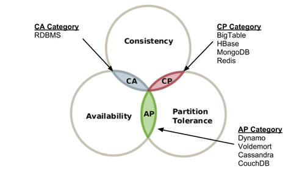

### CAP theorem

**Distributed data store** can provide no more than two out of the following three guarantees:

- Consistency: Every read receives the most recent write or an error
- Availability: Every request receives a (non-error) response, without the guarantee that it contains the most recent write
- Partition tolerance: The system continues to operate despite an arbitrary number of messages being dropped (or delayed) by the network between nodes

### ACID
ACIS is a set of properties of database transactions
- atomicity - whole or nothing
- consistency - from consistent state to consistent state
- isolation - concurrent transaction do not interfere
- duarbility - commited tx will remain

### Isolation problems
1. **Dirty reads**

Tx can see other't tx uncommited change. It may lead to incosistency if 2nd tx rolls back.

2. **Lost updates**

Two concurrent tx can update the same value and the 2nd will overwrite the first one.

3. **Non-repeateable reads**

Tx can see other't tx commited change. It may lead to incosistency if 1st tx reads the same row two times.

4. **Phantom reads**

Tx can see other't tx commited change. It may lead to incosistency if 1st tx reads the **range of rows** with the same WHERE clause two times.

| Read phenomena/ Isolation level 	| Lost updates 	| Dirty reads 	| Non-repeatable reads 	| Phantoms    	|
|------------------------------------	|--------------	|-------------	|----------------------	|-------------	|
| Read Uncommitted                   	| may occur    	| may occur   	| may occur            	| may occur   	|
| Read Committed                     	| may occur    	| don't occur 	| may occur            	| may occur   	|
| Repeatable Read                    	| don't occur  	| don't occur 	| don't occur          	| may occur   	|
| Serializable                       	| don't occur  	| don't occur 	| don't occur          	| don't occur 	|

### ACID implemetation

Locking vs multiversioning (MVCC). MVCC is a sub type of optimistic locking.

