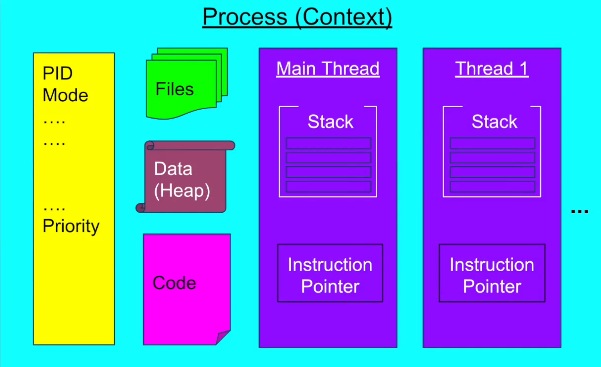

# Java Concurrency

### Process VS thread


* Process is an executing instance of a program and is provisioned with OS resources needed to execute a program.
* Threads running within a process share the same address space, file descriptors and other process related attributes.
* Threads have their own stacks and registers.

### Thread states
`BLOCKED` <- thread is waiting to acquire the monitor, i.e. entering `synchronized`\
`WAITING` <- `Object.wait()` or `Thread.sleep()`

### Daemon thread
A daemon thread is a thread that does not prevent the JVM from exiting when the program finishes but the thread is still running.

### Atomic operation
* Assignments to primitives except `double` and `long`
* Assignments to references (Even 64-bit)
* Assignments to `volatile double` and `volatile long`

### Volatile
A `volatile` variable establishes a happens-before relationship with subsequent reads of that same variable.\
This means that changes to a `volatile` variable are always visible to other threads.

Volatile for double and long.
JLS does not enforce atomic reads and write for 64-bit types even for 64-bit versions of JVMs.\
Programmers are encouraged to declare shared 64-bit values as `volatile`
See https://docs.oracle.com/javase/specs/jls/se17/html/jls-17.html#jls-17.7

### Concurrency problems
1. Race conditions.\
Multiple threads accessing the shared data with non-atomic operations.\
At least one of them writes.

2. Deadlocks.\
Threads are trying to acquire resources to make progress but can not because are waiting for another party to free a resource.


### On interruption
- There is an `interrupted` status
- If a method is declared throwing `InterruptedException`
  - it is a blocking method 
  - supports stopping blocking, i.e. leaving `BLOCKED|WAITING` state.
- A thread is interrupted by some other thread through a call to `Thread.interrupt()`
  - In general, `interrupt()` merely sets the thread's `interrupted` status. The code running in that thread supposed to poll the interrupted status and handle it appropriately, usually throwing `InterruptedException` in the end.
  - If the thread is blocking by `Object.wait()`, `Thread.sleep()`, `join()`, `java.util.concurrent` structures, IO operations - it unblocks, interrupt status gets cleared and an `InterruptedException` is thrown.
- `InterruptedException` catch block can
  - re-throw (propagate)
  - restore status with `Thread.currentThread().interrupt()` (for Runnables)
- `Thread.interrupted()` checks status and resets it while `Thread.currentThread().isInterrupted()` does not affect current status.
- The `interrupted` status gets reset by design because Thread should be able to escape call stack of methods step by step, manually handling interruption in every of them.
- Bad practices:
  - swallow `InterruptedException`
  - re-throwing `RuntimeException` in place of `InterruptedException`

  see https://www.ibm.com/developerworks/java/library/j-jtp05236/index.htm

### Synchronizers

- `CountDownLatch` - one-time, not re-usable. For waiting for some event
- `Semaphore` - to control access to resources. Has a set of N permits. Permits are not associated with threads, i.e. `acquire()` can be in one thread and `release()` can be called from another. In simplest (N=1) case works like non-reentrant `mutex`.
- `Barrier` - allows syncing a fixed number of threads at some point. Works like "we meet at 6PM in the mall and then all go..." Latches are for waiting for events, barriers for waiting other threads.

### Semaphore
Non-reentrant!
```
int numberOfPermits = 1;
Semaphore s = new Semaphore(numberOfPermits);

void func1() {
    s.acquire();
    s.acquire(); // Thread is blocked!
}
```
Has no notion of an owner thread!\
A different thread can release it.

Good choice for producer-consumer scenario.

### Executor. ExecutorService
Executor - primary abstraction for decoupling task submission and task execution (unlike `Thread`) added in Java 5.

Higher level abstraction `ExecutorService` is an extension of the Executor with: 
- `submit()` -> `Executor.execute()` but accepts also `Callable`
- `submit()` returns a Future
- backed by a **ThreadPool**
- can `shutDown()` the ThreadPool
- backed by **WorkingQueue** and **CompletionQueue**

`Executors` utility class provides factory methods for Executor Services with different ThreadPool types.

```
ExecutorService executorService = Executors.newFixedThreadPool(2);
final Future<?> result = executorService.submit(() -> task(input)));
...
executorService.shutdown();
```

`CompletionService` = `ExecutorService + BlockingQueue`.

### Fork/Join Framework
Fork/Join Framework is added in Java 7 and extends ExecutorService.
* Fork/Join Framework is designed for **data parallelism** and employs the _divide and conquer_ approach.\
  It first "forks", recursively breaking the task into smaller independent subtasks, and then "joins" the results.
* ExecutorService Framework is designed for **task-based parallelism**
* Fork/Join also employs the _work-stealing_ algorithm.\
  Free threads try to “steal” work from deques of busy threads.

Fork/Join Framework is backed by the **ForkJoinPool**.\
**ForkJoinTask** is a special task type to submit to the Fork/Join Framework:
* RecursiveTask - task that returns a value
* RecursiveAction - task that does not return a value

Example usage - computation of Fibonacci numbers:
```
class CustomRecursive extends RecursiveTask<T> {
@Override
    T compute() {
        CustomRecursive subtask1 = new CustomRecursive(..);
        CustomRecursive subtask2 = new CustomRecursive(..);
        final ForkJoinTask fork1 = subtask1.fork();
        final ForkJoinTask fork2 = subtask2.fork();
        return fork1.join() + fork2.join();
    }
}
...
new CustomRecursiveAction(workload).compute()
```

### Parallel Stream API
Parallel Stream are backed by the common ForkJoinPool.
Switching between sequential and parallel execution within a stream:
```
emptyList().parallelStream()
        .map(Object::hashCode)
        .sequential() // switching to sequential execution
        .toList();
```
```
emptyList().stream()
        .map(Object::hashCode)
        .parallel() // switching to parallel execution
        .toList();
```

### CompletableFuture
CompletableFuture is an _async reactive functional_ API.
```
// Runs on the Common ForkJoinPool
CompletableFuture.supplyAsync(() -> "Some String")
        .exceptionallyAsync(throwable -> "Fallback value")
        .thenApplyAsync(String::toUpperCase)
        .thenAcceptAsync(s -> System.out.println("Working with value " + s + " in " + Thread.currentThread().getName()))
        .join();
```

Waiting for multiple async tasks:
```
CompletableFuture.allOf(cf1, cf2,...).join();
```

Correspondence between CompletableFuture API and Reactor API
```
| CompletableFuture API                    | Reactor                               | Comment         |
|------------------------------------------|---------------------------------------|-----------------|
| CompletableFuture.supplyAsync()          | Mono.fromSupplier()                   |                 |
| CompletableFuture.completedFuture()      | Mono.just()                           |                 |
| .thenApply()                             | .map()                                | Sync in Reactor |
| .thenComposeAsync()                      | .flatMap()                            |                 |
| .thenAcceptAsync()                       | .doOnNext()                           |                 |
| .thenCombineAsync(other, (o, o2) -> {})  | .zipWith(Mono other, (o, o2) -> {})   |                 |
| .exceptionallyAsync(throwable -> {})     | .onErrorResume(throwable -> {})       |                 |
```

