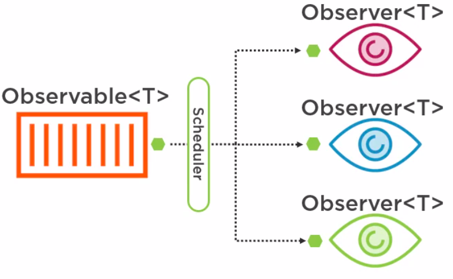

### Reactive manifesto
- Responsive
- Resilient
- Elastic (scalable)
- Message driven (event driven)

### RxJava patterns
#### Observer
Observers subscribe to *observable* subject\
`Observable` ---[events]---> `Observers`

`Observable<T>`, where `T` - class type for events.

