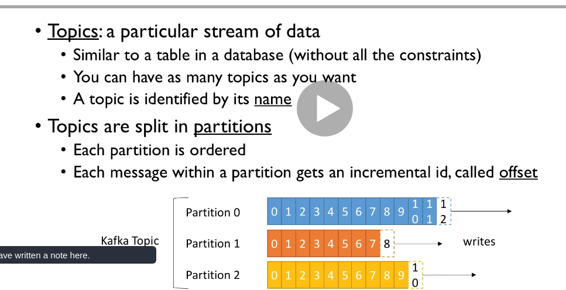
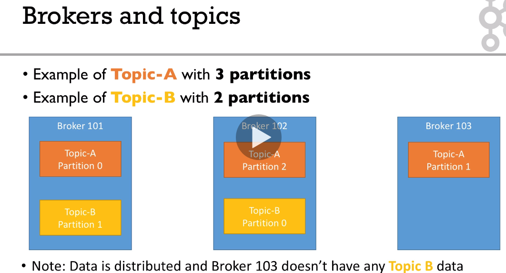
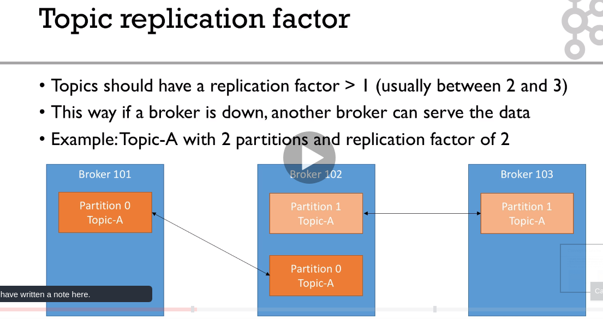
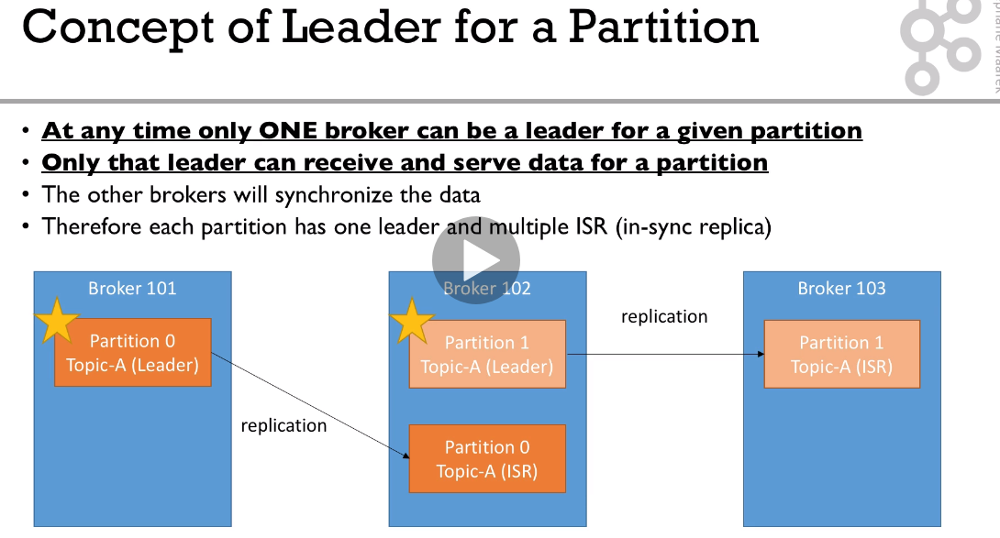
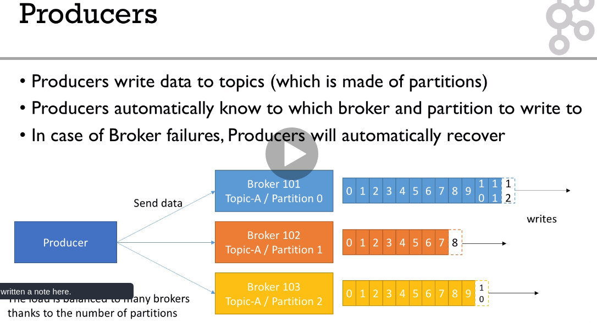
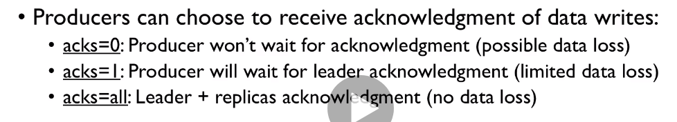
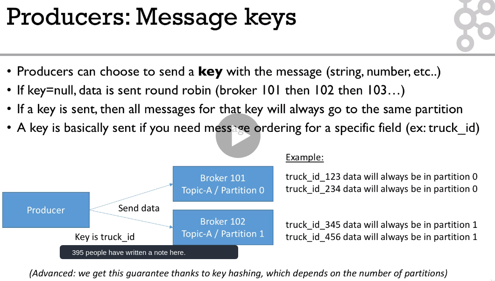
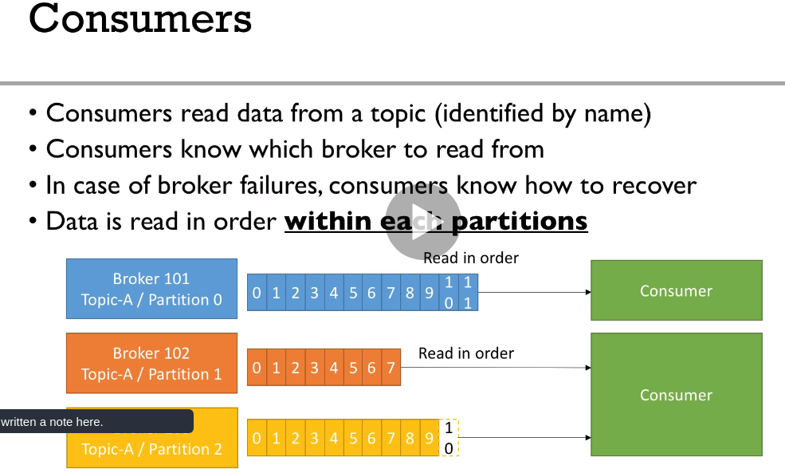
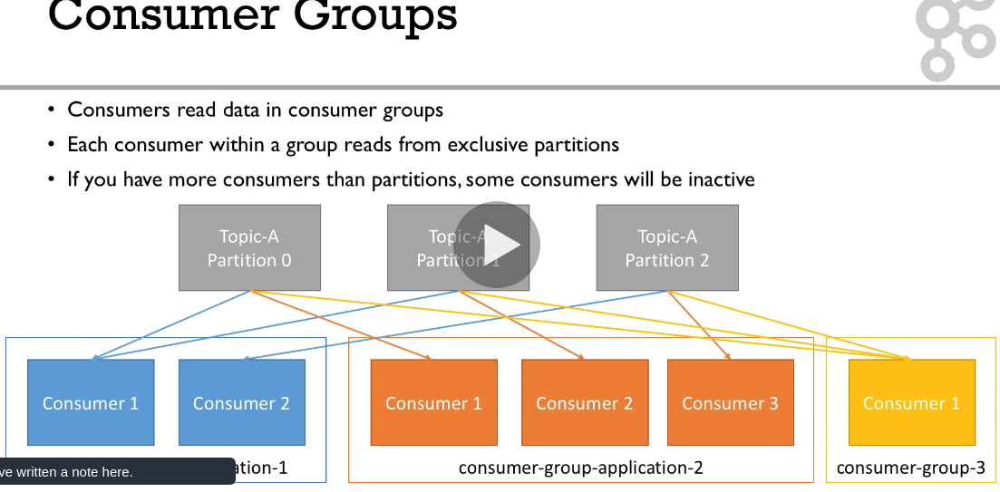
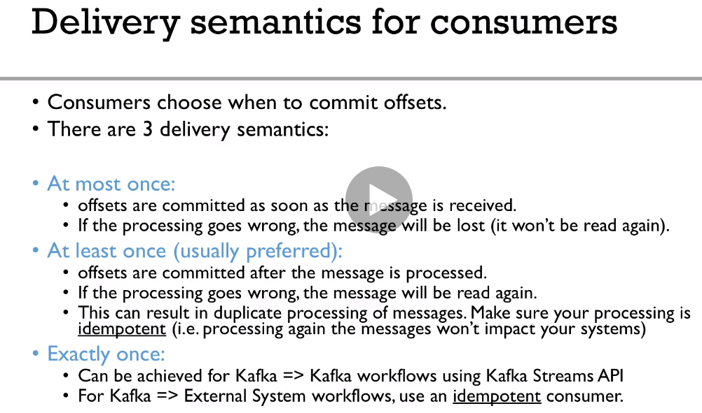

## Kafka core concepts

#### Topics and Partitions.
:exclamation: message order is guaranteed only within the same partition\
:exclamation: offsets are relevant to a topic-partition pair


#### Topics and brokers:

Each broker is a "bootstrap server", i.e. upon connecting to it a consumer 
receives the list of all other brokers and connects to the entire cluster.

Kafka is backed by the Zookeeper.\
Zookeeper manages brokers and perform leader election if necessary.

#### Replication factor.

:exclamation: Replication factor can not be higher than the number of brokers.

#### Partition leader:


#### Producers
Producer sends data to a **topic** only and does not ask for a broker or a partition.\
Upon connecting to any broker it connects to the whole cluster. \
By default (if message keys not used) messages are sent to partitions in round robin.


Producers can choose an acknowledgement mode:


#### Message Keys
Message keys can be specified. Messages with the same key go to the same partition, thus ensuring order between them.


#### Consumers
Consumers can subscribe to one or more **partitions** within the **topic**.
So effectively number of consumers should be <= number of partitions.


#### Consumer groups
Consumers can be aggregated in consumer groups.
Each consumer group consumes messages independently, i.e.  


Each consumer group has a service topic named `__consumer_offsets` where it stores current offsets for partitions.
When a consumer commits an offset it is stored in this topic.

#### delivery semantics
:exclamation: It is important usually to make Kafka Consumers idempotent!



## Commands

Create a topic
```
./kafka-topics.sh --bootstrap-server localhost:9092 --topic first_topic --create --partitions 3 --replication-factor 1 
```

List topics
```
./kafka-topics.sh --bootstrap-server localhost:9092 --list
```

Describe a topic
```
./kafka-topics.sh --bootstrap-server localhost:9092 --topic first_topic --describe

Topic: first_topic	PartitionCount: 3	ReplicationFactor: 1	Configs: segment.bytes=1073741824
	Topic: first_topic	Partition: 0	Leader: 0	Replicas: 0	Isr: 0
	Topic: first_topic	Partition: 1	Leader: 0	Replicas: 0	Isr: 0
	Topic: first_topic	Partition: 2	Leader: 0	Replicas: 0	Isr: 0

```
`Leader 0` refers to a broker with id = 0

Using a producer. Submitting a message.
```
/kafka-console-producer.sh --broker-list localhost:9092 --topic first_topic
```
Producer with keys:
```
kafka-console-producer --broker-list 127.0.0.1:9092 --topic first_topic --property parse.key=true --property key.separator=,
> key,value
> another key,another value
```
:exclamation: If a producer submits a message to non-existing topic, it will be created.

Using a consumer. 
Starting consuming messages:
```
./kafka-console-consumer.sh --bootstrap-server localhost:9092 --topic first_topic
```
Start a consumer and read all messages with uncommitted offsets for  this group:
```
./kafka-console-consumer.sh --bootstrap-server localhost:9092 --topic first_topic --from-beginning
```
Start a consumer inside a consumer group:
```
./kafka-console-consumer.sh --bootstrap-server localhost:9092 --topic first_topic --group group1
```
Consumer with keys:
```
kafka-console-consumer --bootstrap-server 127.0.0.1:9092 --topic first_topic --from-beginning --property print.key=true --property key.separator=,
```

List consumer groups
```
./kafka-consumer-groups.sh --bootstrap-server localhost:9092 --list
```

Describing a group:
```
./kafka-consumer-groups.sh --bootstrap-server localhost:9092 --describe --group group1


GROUP                  TOPIC           PARTITION  CURRENT-OFFSET  LOG-END-OFFSET  LAG             CONSUMER-ID                                                            HOST            CLIENT-ID
console-consumer-17869 first_topic     0          -               2               -               consumer-console-consumer-17869-1-614d0475-4704-450c-b147-6e1c15e9af5d /127.0.0.1      consumer-console-consumer-17869-1
console-consumer-17869 first_topic     1          -               1               -               consumer-console-consumer-17869-1-614d0475-4704-450c-b147-6e1c15e9af5d /127.0.0.1      consumer-console-consumer-17869-1
console-consumer-17869 first_topic     2          -               2               -               consumer-console-consumer-17869-1-614d0475-4704-450c-b147-6e1c15e9af5d /127.0.0.1      consumer-console-consumer-17869-1

```
Lag shows unread messages in each partition.\
:exclamation: It is possible to reset offsets for a consumer group
