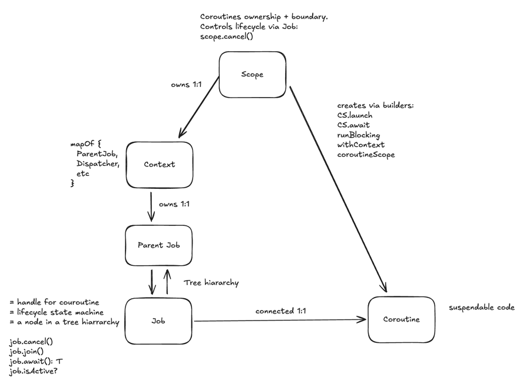

# Kotlin Coroutines

### Core concepts

Context. Scope. Coroutine. Job.


### Suspend functions

A `suspend` function is a function that can suspend, which means the compiler rewrites it to work with a `Continuation`.
The extra `Continuation` parameter stores where execution should resume and carries the coroutine context (Job,
dispatcher, etc.).

Compilation difference (simplified)

```kotlin
//Normal function:
fun foo(x: Int): String = "ok"

//Compiled shape (conceptual):
fun foo(x: Int): String

//Suspend function:
suspend fun foo(x: Int): String = "ok"

//Compiled shape (conceptual):
fun foo(x: Int, cont: Continuation<String>): Any?
```

### Coroutine builders

| construct               | what it does                                                 | where can be used                                                                      | when to use                                                                     | creates a scope                  |
|-------------------------|--------------------------------------------------------------|----------------------------------------------------------------------------------------|---------------------------------------------------------------------------------|----------------------------------|
| CoroutineScope.launch{} | starts a child coroutine, returns Job, no result             | must be called on a CoroutineScope (explicit `scope.launch` or implicit `this.launch`) | fire-and-forget work tied to scope lifecycle                                    | no (uses existing scope)         |
| CoroutineScope.async{}  | starts a child coroutine, returns Deferred<T>                | same as `launch`                                                                       | parallel work when you need a result                                            | no (uses existing scope)         |
| runBlocking()           | runs a coroutine and blocks until it completes               | top-level only (main, tests). provides an implicit CoroutineScope inside               | use to run suspend code from blocking code                                      | yes (root scope)                 |
| withContext()           | switches coroutine context for a suspend block               | must be executed inside a running coroutine (i.e., inside suspend code)                | use to switch dispatcher for a block of code  (for example IO or Default)       | no (same scope, updated context) |
| coroutineScope{}        | creates a child scope and suspends until all children finish | must be executed inside a running coroutine (i.e., inside suspend code)                | use when you need to start several coroutines and wait until all of them finish | yes (child scope)                |

### Dispatchers

| dispatcher             | purpose                           | threads / pool                            | typical use cases                                 |
|------------------------|-----------------------------------|-------------------------------------------|---------------------------------------------------|
| Dispatchers.Default    | cpu-bound work                    | shared fork-join pool (≈ number of cores) | parsing, calculations, diffing                    |
| Dispatchers.IO         | blocking io                       | shared elastic pool (up to ~64+ threads)  | database calls, http, file io, blocking libraries |
| Dispatchers.Main       | ui thread                         | single main thread                        | android ui updates                                |
| Dispatchers.Unconfined | no fixed thread, runs immediately | caller thread → resumes anywhere          | tests, low-level primitives                       |

