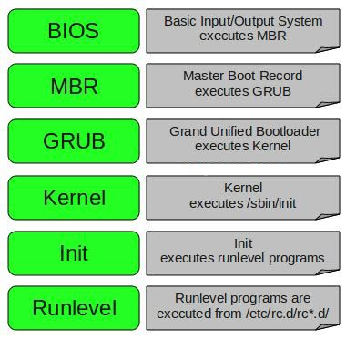

# Linux-refcards

### Bash shortcuts

- `Ctrl+C` – send `SIGINT` to the current process, i.e. "interrupt" in most cases
- `Ctrl+D` – send `EOF` which has an effect if a program is reading standart input from the terminal
- `CTRL+Z` – suspend the current command. Show background processes with `jobs`. Resume it with `fg` in the foreground or `bg` in the background.
- `Ctrl+A` – go to the beginning of a line.
- `Ctrl+E` – go to the end of a line.
- `CTRL+K` – delete all characters after the cursor.
- `Ctrl+U` – delete from cursor to the start of the command line
- `CTRL+L` – clear the screen.
- `CTRL+R` – search the command history backward.

### Bash control operators. Redirections

`;` : Will run one command after another has finished, irrespective of the outcome of the first\
`command1 ; command2`

`&` : This will run a command in the background, allowing you to continue working in the same shell.\
`command1 & command2`\
`command1 &` (with no command2) will launch command1 in the background and then issue another shell prompt immediately.

`&&` : Allows you to run one command only if another exited successfully if its exit code was 0).\
`command1 && command2`

`||` : Allows you to run one command only if another exited unsuccessfully (if it returned an exit status other than 0).\
`command1 || command2`

`|` : The pipe operator, it passes the output of one command as input to another. Any output printed by command1 is passed as input to command2.\
`command1 | command2`

Streams `stdin`, `stdout` and `stderr` are tagged as `0`, `1` and `2`

`>` - directs the output of a command into a file. `1>` or just `>` for standart output, `2>` for error output\
`command > out.txt`\
`>>` - appends (if the target file exists)\
`ps -aux >> log`

`<` - gives input to a command:\
`command < file.txt`

Example, to run command on file.txt and save its output in out.txt and any error messages in error.txt you would run:\
`command < file.txt > out.txt 2> error.txt`

`&>`, and `&>>` redirect both standard error and standard output, replacing or appending, respectively.\
`command &> out.txt`

`2>&1` means redirect `stderr` to `stdout` and is standard for Bourne/POSIX shell\
`&>` is a bash extension and not de jure standard, so in bash:\
`program &>> result.txt`  is equivalent to `program >> result.txt 2>&1`

`<<` is known as here-document\
`<<<` is known as here-string

### Searching

Finds file here and recursively,  `-type f` = files only:\
`find . -name <file> -type f`

Finds file which name begins with *"Chapter"*, `-iname` = case insensitive:\
`find /usr -iname "Chapter*" -type f`

How do I remove files as a result of the find command?\
`find -iname "<file>*" -delete`

`find` VS `locate`\
`locate` uses embedded db, while `find` is always a live search.

Finds all files in the root dir that changed within last 24 hours **in the background** and stores it to the file:\
`find / -ctime -1 > /tmp/changed-file-list.txt &`

`grep` vs `egrep`: egrep accepts search templates `+` `?` `|`.\
Useful alias for `grep`:\
`alias grep='egrep --color'`

To display all lines in a file *test.txt* that matches a pattern, `-i` = ignore case :\
`grep -i <pattern> test.txt`

Grep in current folder, `-r` = for all subfolders, `-i` = ignore case, `-l` = give filenames, `-n` = line number\
`grep -r <pattern> .`

Grep in a file with +-3 rows around:\
`grep -C 3 -- <pattern> file.txt`

Search recursively for all `.cc` OR `.h` files that contain *"hello"* at current dir:\
`grep -r --include=*.{cc,h} "hello" .`

Find files containing <pattern1> and not containing <pattern2>:\
`grep -rlZ 'pattern1'  . | xargs -r0 grep -FL 'pattern2'`\
where `-Z` and `-r0` to build `grep` -> `xargs` pipeline, `-l` = files-with-matches, `-r` = recursive, `-F` = Interpret PATTERN as a list of fixed strings (instead of regular expressions), `-L` = files-without-match

### Filesystem

Create a file:\
`touch file1` // note that `touch` originally is for updating timestamps on a file\
Create a directory:\
`mkdir test`

Copy file3 to a new file called file4:\
`cp file3 file4`\
If the target is an existing dir, the file or dir is copied into the target:\
`cp file1 dir`\
Copy the `dir1` directory structure to a new `dir2`:\
`cp -r dir1 dir2`

Move `file1` into the `test` directory:\
`mv file1 test`\
Move that file back:\
`mv test/file1 .`\
Rename the `test` directory to `testing`:\
`mv test testing`

Remove a regular file:\
`rm file4`\
Remove non-empty directory `dir1` and everything within it:\
`rm -r again`

Navigation hints:
- `cd` leads to home dir (or `~`)
- `cd -` leads to previous dir

File permissions are described as: `[type][owner][group][others]`\
Types are file(`-`), directory(`d`), link(`l`), e.g. `drwxr-xr-x`.

Check file system type:\
`stat -f -L -c %T models`

How to remove files from the list:
```
while read name; do
  rm "${name/$'\r'/}"
done < list.txt
```

Check disk usage in this directory:\
`du -shc *`

Check disk space and partitions:\
`df -lH`

Check disk size:\
`fdisk -l`

Change  access permissions to filesystem objects:\
`chmod 664 sharedFile` sets read and write permissions for user and group, and only read to others\
`chmod a+r publicComments.txt` adds read permission for all\
`chmod ug=rx main.log` sets permissions for user and group (ug) to rx

Notation: 
- owner(`u`), group(`g`), other(`o`), all(`a`) 
- adds(`+`), removes(`-`), sets(`=`)
- read(`r`), write(`w`) and execute(`x`)

Octal permissions table:

| Octal       | 0   | 1   | 2   | 3   | 4   | 5   | 6   |  7  |
|-------------|-----|-----|-----|-----|-----|-----|-----|-----|
| Permissions | --- | --x | -w- | -wx | r-- | r-x | rw- | rwx |

Change owner of a file:\
`chown name_of_new_owner file_name`, e.g.\
`chown -R unbound:unbound /var/lib/unbound`

**Umask** = user file creation mode mask. Маска, меняющая права доступа, которые присваиваются новым файлам и каталогам по умолчанию.\
В Linux базовые права для директории равны 0777 (rwxrwxrwx), а для файла 0666 (rw-rw-rw).\
Umask "отбирает" необходимые права в нужных разрядах: 7-ка полностью все, 2-ка права на запись, 0 оставляет по умолчанию.\
Дефолтная umask 0002 используется для обычного пользователя. С этой маской права по умолчанию для директории 775, а для файла 664.\
Пример с другой umask:
```
umask 077
touch file.txt
ls -l file.txt
...
-rw------- 1 hb hb 0 2010-02-19 05:21 file.txt
```

**Hardlinks VS Symlinks** (Symbolic or Soft links):
- hardlink references to the same **Inode** value as the original file.\
Hardlinks remain linked even if the original or linked files are moved throughout the file system or deleted
- softlink is like a shortcut in Windows

**Partitions managment**

Create a partitions with `fdsik`:
```
fdisk /dev/sdb
```

Assign File System type to the partition, e.g. `xfs`:
```
mkfs.xfs /dev/sdb1
```

Mount a partition to dir `/data`
```
mount /dev/sdb1 /data
```
To make this partition be auto-mounted on reboot edit `etc/fstab` that contains information about partitions

To unmount:
```
umount /data
```

To mount everthing from `etc/fstab`
```
mount -a
```

**LVM (Logical Volume Manager) system**
It bring additional layer of abstraction between physical devices and file systems.\
It allows merging physical devices into a "Volume group" and then splitting it to "Logical volumes".

disk1 -> volume_group1 -> logical_volume1
                       -> logical_volume2

disk2 ->               -> logical_volume3
disk3 -> volume_group2 -> logical_volume4
disk4 ->               -> logical_volume5
                       -> logical_volume6

**Swap management**
Add swap instructions.\
Create a swap file
```
dd if=/dev/zero of=/newswap bs=1M count=1024
```
`dd` = command to copy byte per byte, `if` = source, read from a given file instead of standart input, `/dev/zero` = special file that provides null characters, `of` = destination, write to a given file instead of standart output, `bs` = number of bytes to write at once, `count` = how many pieces to copy, i.e. total size.
Unlike `/dev/null`, `/dev/zero` may be used as a source
```
chmod go-r newswap # to set permissions only to root as 600
mkswap /newswap # make a swap
swapon /newswap # enable swap
free -h # check if it is enabled
```
To make it be enabled during boot time, add to `/etc/fstab` following line:\
`/newswap swap swap defaults 0 0` 

**File System check**
`fsck` utility to check ext2,ext3,ext4 FS. PArameter is actual filesystem, not mapped one, e.g.
```
fsck /dev/sdb1
```
`xfs_repair` to check and repair XFS FS. `xfs_repair` may need to unmount the FS first.

How to check current FS type?
```
df -HT # T for list current FS type
```


### Users Management

`sudo` VS `su`:\
`sudo` allows to run commands at root level. It is configured with `/etc/sudoers` and requires user's password, not root's.\
There is also a `sudoedit <file>` alias for safe editing files other than `/etc/sudoers` and `visudo` for safe editing `/etc/sudoers`.\
`su` is an old utility to simply change user, e.g. `sudo - <user1>` to become user1 or `sudo -` to become root.

что хотим сделать? | правильно	| неправильно
------------ | ------------- | -------------
выполнить команду от имени root | `sudo command` | `su -c command`
отредактировать файл от имени root | `sudoedit file` | `su vim file`, `sudo vim file`
получить оболочку root | `sudo -i` | `su -`, `sudo su -`

Commands related to user managment:
- `useradd`, `userdel` - basic *nix commands
- `adduser`, `deluser` - high level comands, set up the account's home folders and other settings, distro specific
- `groupadd`, `groupdel`
- `usermod` - to modify a user
- `visudo` - to safely edit a `/etc/sudoers` file
- `sudoedit <file>` to safely edit files

Files related to user management:
- `/etc/passwd` - list of users with their names, encrypted passwords (usually like `x`), ids, default group ids, home dirs and shells
- `/etc/group` - list of groups and their members
- `/etc/shadow` - available only for root and stores encrypted passwords
- `/etc/sudoers`

Add current user to docker group to avoid using sudo each time:\
`sudo usermod -aG docker ec2-user`, where `docker` = group.

Add a user to sudoers group, `-a` = adding to supplementary group, not primary:\
`sudo usermod -a -G sudo <user>`

Change user password:\
`passwd <user>`

Adding user:\
`useradd -g superheroes -s /bin/bash -c "user description" -m -d /home/user1 user1`, where `-g` = group, `-s` = shell,  `-m` = create home dir, `-d` = home dir path. 

On Debian `adduser` is preferable:
`adduser [user-name]`

`id <user>` - prints user id and user groups.

`finger <user>` - prints info about users

`who` - shows who is logged in

### System

Power commands:
- `shutdown <time>` - allows to schedule poweroff/halt/reboot. To poweroff instantly use `shutdown now`
- `halt` - stops CPU, but keeps it powered on
- `poweroff` - turns off power
- `reboot`

Check if process is alive:\
`ps -elf | grep -i <name>`

Check if process is hung?:\
`top` => check top processes for %CPU and %MEM 

Kill process:\
`kill -9 <pid>` or `pkill <name>`

Display a system monitor with all processes:\
`top`

Set a process **scheduling** priority:\
`nice -n [-20-19] process` // `-20` for most favorable to the process

How to change priority of a running processes?\
`renice -n 15 -p 7314`

Delay for a specified amount of time:\
`sleep 5`

Show *curr time | uptime | # of users | avg CPU load for 1, 5 and 15 mins*:\
`uptime`

Show machine name:\
`hostname`\
Hostname is stored in `/etc/hostname`. To change machine hostame:\
`hostnamectl set-hostname <name>`

Shows system OS name:\
`uname`\
`uname -a` - shows also kernel version and other info

Description of the system's hardware components, as well as other useful pieces of information such as serial numbers and BIOS revision:\
`dmidecode`

Show or set the system's host name:\
`hostname`

Prints the message buffer of the kernel which typically contains messages produced by device drivers:\
`dmesg > dmesg.txt`

Report statistics for CPU, IO devices, partitions and network filesystems (NFS), `-1` = refresh every sec:\
`iostat 1`

Display amount of free and used memory in the system, swap information:\
`free -h`

Show CPU info:\
`cat /proc/cpuinfo`

Show memory info:\
`cat /proc/meminfo`

System run levels. 
ID | Name	| Description
------------ | ------------- | -------------
0 | `Halt` | `Shuts down the system`
1 | `Single-user mode` | `Mode for administrative tasks`
2 | `	Multi-user mode` | `Networking disabled`
3 | `Multi-user mode with networking` | `Starts the system normally`
5 | `Start the system normally with appropriate display manager (with GUI)` | `Starts the system normally in GUI mode`
6 | `Reboot` | `	Reboots the system`
Usage:
```
init <#>
```
To find current run level:
```
who -r
```

Linux boot process:



**Systemctl** is a command to use `systemd` service manager.\
Starting a service:\
`sudo systemctl [start|stop|restart] application`

Enabling service at system startup:\
`sudo systemctl [enable|disable] application`

Check service status:\
`systemctl status application`

**Sysctl** - команда, предназначенная для управления параметрами ядра на лету. Позволяет читать и изменять параметры ядра. Например, такие параметры как размер сегмента разделяемой памяти, ограничение на число запущенных процессов, а также включать функции наподобие маршрутизации.\
Имеет конфигурационный файл `/etc/sysctl.conf`, в котором переопределяются необходимые параметры.\
To apply new values:\
`sysctl -p`

### Scheduling

**Cron** is a daemon that executes scheduled commands.\
**Crontab** is a file that allows to schedule user scripts/commands.\
Open and edit crontab in editor:\
`crontab -e`

The chrontab syntax is `[minute] [hour] [day_of_the_month] [month] [day_of_the_week] [command]`, where astrics (`*`) matches anything, hyphen(`-`) defines range like: `1-10` or `sun-fri` or `feb-apr`.

Schedule a cron to execute at 2am daily:\
`0 2 * * * /bin/sh backup.sh`\
Schedule a cron to execute on every four hours:\
`0 */4 * * * /scripts/script.sh`\
Schedule tasks to execute on system reboot:\
`@reboot /scripts/script.sh`

Check user chrontab:\
`chrontab -l`

Additionally, cron reads the root cron jobs (not user's) in `/etc/cron.[d,daily,hourly,monthly,weekly]` dirs.\
When exactly cron runs monthly, weekly or daily is specified in `/etc/anacrontab` and hourly in `/etc/cron.d/0hourly`.
  
### Text/Data processing Utils

**Awk** is a utility/language designed for data extraction.

Print sorted list of login names where `-F:` = separator, `$1` = first column:\
`awk -F: '{ print $1 }' /etc/passwd | sort`

Print only elements from column 2 that match pattern:\
`awk ' /'pattern'/ {print $2} ' <file>`

**Sed** is a Stream Editor that transforms text. It works with stdin and stdout.

Replace a string with a new string for all occurrences, where `s` is `s/regexp/replacement/` command, `g` = globally (all occurences), `-i` for in-place insert (update source file):\
`sed -i 's/Nick/John/g' report.txt`

Delete all occurences:\
`sed -i 's/Nick//g' report.txt`

Delete all lines with the given pattern. This will no update the file:\
`sed '/<pattern>/d' <file>`

Delete all empty lines:\
`sed -i '/^$/d' <file>`

Delete pattern from standart input with `-e`:\
`grep ... | sed -e 's/@InjectMocks//g'`

**Cut** is a utility for cutting out sections from each line of a file. It writes a result to stdout.

Extract all users from /etc/passwd:\
`cut -d: -f1 /etc/passwd`

Extract first 10 chars:\
`cut -c1-10 <file>`

**Sort** - sort lines of text.

Show files sorted by size, `-n` for numeric sort, `-k5` for sort by fifth column, `-u` for unique, `-r` for reverse order:\
`ls -la | sort -nk5`

**Uniq** - report or omit duplicate lines.

**Diff** - compare files line by line.

Compare 2 files, `-y` for comparing in two columns side by side:\
`diff -y file1 file2` 

**Wc** - wordcount.

Count # of lines in the 1st file and write it to the 2nd file, where `-l` = count newlines:\
`wc -l file1.txt | tee -a file2.txt`

**Split** - split files, can be useful for large files.

Split *file1* writing each 2 lines from it into *file2aa, file2ab* ... :\
`split -l 2 <file1> <file2>`

Split to files with size=20mB:\
`split -b 20M split.zip ` 

Reassemble split files *file1aa, file1ab* ... with `cat`:\
`cat file1?? > file2`

### Package managers

There are 2 main branches of package management: DEB (`apt`) and RPM (`yum`).

`apt-get update` updates the list of available packages and their versions, but it does not install or upgrade any packages

`apt-get upgrade` actually installs newer versions of the packages

`apt-get dist-upgrade`  will upgrade to a new kernel

`apt-get autoremove` to remove packages that are now no longer needed

`apt-get autoclean` clears out the local repository of retrieved package files

Search for programs in package manager:\
`apt search torrent client` - 1st option\
`apt-cache search jdk` - 2nd option (different output)

List all installed packages:\
`apt list --installed`

Remove packages:\
`sudo apt-get remove <package>`

Using multiple java distributions:\
`sudo update-alternatives --config java`

Adding PPA repository:\
`sudo add-apt-repository ppa:hda-me/wireguard`\
`sudo apt update`

When and what packages were installed:\
`cat /var/log/apt/history.log`

### Compressing

`tar` is an utility for collecting many files into one archive file, often referred to as a *tarball*. Can use *gzip* or *bzip2* compression utils.

`tar -czfv txt.tar.gz *.txt` for archiving all txt files, `-c` = create new archive operation mode, `-z` = use gzip compression, `-f` = to file, `-v` = verbose mode.

`tar -xvf /path/to/archive.tar.gz` for unpacking, `-x` = extract files from an archive operation mode

`tar -xvf public_html-14-09-12.tar -C /home/public_html/videos/` to extract files to specific directory

`tar -tf archive.tar.gz` for listing, `-t` = list the contents operation mode

`gzip filename` to compress a file

`gunzip filename.gz` to decompress a file, which is equivalent to `gzip -d filename.gz`

### Other Utils

`man <command>` bring up manual for the specified command\
`man -f <command>`, `-f` for short 1-line description, which is also equivalent to: `whatis <command>`

`whereis java` - locate the binary, source, and manual page files for a command\
`which java` - shows the full path to command binary (i.e. executable)

`which` to find the location of a program\
`which firefox` => `/usr/bin/firefox`

`cal` - calendar\
`cal 2019` - shows all months in the given year

`date` - date

`history` bring up shell commands history\
`history | grep <command>`

`cat` reads files sequentially, writing them to standard output (concatenate files)

`less`, `more` are terminal pager programs

`ln` to create hard and soft links to files

`tee` reads standard input and writes it to both standard output and one or more files.

`whoami` - print effective userid

`head` - output the first part of files\
`tail` - output the last part of files

`bc` - basic calculator

`nohup` — UNIX-утилита, запускающая указанную команду с игнорированием сигналов потери связи (`SIGHUP`). Т.о., команда будет продолжать выполняться в фоновом режиме и после того, как пользователь выйдет из системы.\
The first of the commands below starts the program abcd in the background in such a way that the subsequent logout does not stop it:\
`nohup abcd &`\
`exit`\
Note that nohupping backgrounded jobs is typically used to avoid terminating them when logging off from a remote SSH session. A different issue that often arises in this situation is that ssh is refusing to log off ("hangs"), since it refuses to lose any data from/to the background job(s).This problem can also be overcome by redirecting all three I/O streams:\
`nohup ./myprogram > /dev/null 2>&1 &`

`xargs` reads items from standard input as separated by blanks and executes a given command (or an `echo` if absent) once for each argument, for eaxample:\
`echo 'one two three' | xargs mkdir`

By default, xargs terminates/delimits items using blank spaces. Specify delimiter using `-d` option, for example `xargs -d\n` for newlines.

Files older than two weeks in the temp folder are found and then deleted, `-t` = report to terminal, `-p` = prompt on each run:\
`find /tmp -mtime +14 | xargs -t -p rm`

`-I` = replace string, can be used to execute multiple commands:\
```
cat foo.txt
one
two
three

cat foo.txt | xargs -I % sh -c 'echo %; mkdir %'
one 
two
three

ls 
one two three
```

Generate a compact (concatenated) list of all Linux user accounts:\
`cut -d: -f1 < /etc/passwd | sort | xargs`

Find out all the `.png` images and archive them, `-0` deals with spaces in filenames:\
`find Pictures/tecmint/ -name "*.png" -type f -print0 | xargs -0 tar -cvzf images.tar.gz`\
Here `-print0` enables printing of the full file path on the stdout followed by a null character (instead of the newline character that `-print` uses). This allows file names  that contain newlines or other types of white space to be correctly interpreted by programs like `xarg`.

Limit Output Per Line Using `-n`:
```
echo a b c d e f| xargs
a b c d e f
$ echo a b c d e f| xargs -n 3
a b c
d e f
```

Find all the files (among the files provided by find command) that contained a string ‘stdlib.h’:\
`find . -name '*.c' | xargs grep 'stdlib.h'`

### Vi

`i` to enter text insert mode\
`esc` to return to command mode\
`:` to enter extended commands mode\
`:q!` to exit without saving\
`:wq!` or `ZZ` to save and exit\
`dd` or `:d`	to delete current line

### Logs
Log dir is `/var/log`.
There are following most common logs:
- `var/log/messages` or `/var/log/syslog` (Ubuntu) содержит глобальный системный журнал, в котором пишутся сообщения с момента запуска системы, от ядра Linux, различных служб, обнаруженных устройствах, сетевых интерфейсов и много другого. Most important log.
- `var/log/boot.log` — Информация, которая пишется при загрузке операционной системы. Каждый раз файл перезаписывается.
- `/var/log/auth.log` или `/var/log/secure` — информация об авторизации пользователей, включая удачные и неудачные попытки входа в систему, а также задействованные механизмы аутентификации.
- `/var/log/dmesg` — драйвера устройств. Одноименной командой можно просмотреть вывод содержимого файла.
- `/var/log/cron` — Отчет службы crond об исполняемых командах и сообщения от самих команд.
- `/var/log/faillog` — Неудачные попытки входа в систему.
- `/var/log/dpkg.log` — Журнал менеджера пакетов в Debian семействе.
- `/var/log/yum.log` — Для программ установленных с помощью Yum в RedHat Linux.
- `/var/log/alternatives.log` — Вывод программы update-alternatives, в котором находятся символические ссылки на команды или библиотеки по умолчанию.
- `/var/log/mysql/` — Лог базы данных MySQL.
- `/var/log/httpd/` или `/var/log/apache2/` — Лог веб сервера Apache.

### Scripts
To save a terminal session (commands and output) to a file use:\
`script <script_name>`\
`exit`

### Shell scripting

Rules:
- script starts with `#!/bin/bash` (shebang)
- script must be executable (`chmod a+x <script.sh>`)
- script is invoked as `./<script_name>` or as `<script_name>` if containing dir is added to `$PATH`

Defining variables
```
#!/bin/bash
# Example of defining variables

c=’Linux class’

echo "This is a $c"
```

Read Input
```
#!/bin/bash
# Read user input

echo "What is your name?"
read a
echo

echo Hello $a
```

Scripts to run commands within
```
#!/bin/bash
# Script to run commands within

clear
echo "Hello `whoami`"
echo
echo "Today is `date`"
echo
echo "Number of user login: `who | wc -l `"
echo
```

Read input and perform a task
```
#!/bin/bash
# This script will rename a file

echo Enter the file name to be renamed
read oldfilename

echo Enter the new file name
read newfilename

mv $oldfilename $newfilename
echo The file has been renamed as $newfilename
```
### Defining aliases

To create an alias one way is to edit `.bashrc` file:\
`gedit ~/.bashrc`
Add alias:\
`alias grep='grep --color'`
Apply changes:\
`source ~/.bashrc`
