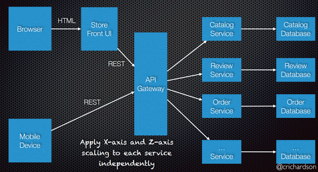

## Microservice Architecture
An architecture that structures the application as a set of loosely coupled, collaborating services.

The services are small and fine-grained to perform single functionality.

Services communicate using either synchronous protocols such as HTTP/REST or asynchronous messaging protocols. 

Services can be developed and deployed independently of one another, can have their own databases. 

Example:

#### Benefits
- Enables the **CI/CD** of large, complex applications.
  - Better testability - services are smaller and faster to test
  - Better deployability - services can be deployed independently
  - Development organized around multiple teams. Each team is responsible for one or more single service and can develop, deploy and scale their services independently.
- The services are easy to replace.
- Each microservice is relatively small - easier for a developer to understand
- Improved fault isolation, e.g. if there is a memory leak in one service then only that service will be affected.
- Eliminates any long-term commitment to a technology stack.

#### Drawbacks
- Additional complexity of creating a distributed system.
  - Testing is more difficult
  - Developers must implement the inter-service communication mechanism.
  - Implementing multiple services without using distributed transactions is difficult
  - Implementing multiple services requires careful coordination between the teams
- Increased deployment and operational complexity.
- Increased resources consumption. When each service runs in its own JVM or even on its own VM (e.g. EC2 instance), there is a certain overhead.
- The architecture introduces new problems to deal with:\
**network latency, message formats, data consistency, distributed transactions, load balancing, fault tolerance**.

## Common Issues an Patterns

### Communication style
Services must sometimes collaborate to handle client's requests. Hence they must use some communication protocol.
#### 1. Remote Procedure Invocation (RPI)
The client uses a request/reply-based protocol to make requests to a service, e.g, HTTP/REST.

Pros:
- Simple and familiar
- Simpler system since there in no intermediate broker

Cons:
- Usually only supports request/reply and not other interaction patterns
- Reduced availability since the client and the service must be available for the duration of the interaction

#### 2. Messaging
Asynchronous messaging for inter-service communication. Services communicate by exchanging messages over messaging channels.\
Examples: Apache Kafka, Amazon SNS, Rabbit MQ.

Pros:
- Loose coupling since it decouples client from services
- Improved availability since the message broker buffers messages until the consumer is able to process them
- Supports a variety of communication patterns: request/reply, notifications, request/async response, publish/subscribe, publish/async response etc

Cons:
- Additional complexity of message broker, which must be highly available

In both cases, client needs to discover location of either the service itself or the message broker.

### Decomposition
How to decompose an application into services?
- The architecture must be stable
- Services must be cohesive: it should implement a small set of strongly related functions.
- Services must conform to the Common Closure Principle: things that change together should be packaged together to ensure that each change affects only one service
- Services must be loosely coupled - each service as an API that encapsulates its implementation. The implementation can be changed without affecting clients
- A service should be testable
- Each service be small enough to be developed by a team of 6-10 people
- Each team must be able to develop and deploy their services with minimal collaboration with other teams.

[Domain-Driven Design](https://en.wikipedia.org/wiki/Domain-driven_design) (**DDD**) defines services as subdomains. Each subdomain corresponds to a different part of a business. Examples of subdomains of an online store may include:
- Product catalog
- Inventory management
- Order management
- Delivery management

### Deployment
How are services packaged and deployed?
There are several ways:
#### 1. Service instance per host
Run multiple instances of different services on a host (Physical or Virtual machine).
Various ways of deploying a service instance:
- Each service instance as a JVM process, e.g. a Tomcat instance per service instance.
- Multiple service instances in the same JVM, e.g. OSGI bundles.

Pros:
- More efficient resource utilization

Cons:
- Risk of conflicting resource requirements
- Risk of conflicting dependency versions
- Difficult to limit resources consumed by a service instance
- Impossible to isolate each instance

#### 2. Service instance per VM
Package the service as a virtual machine image and deploy each service instance as a separate VM (e.g. EC2 instance)

Pros:
- Easy to scale a service by increasing the number of instances. AWS Autoscaling Groups can even do this automatically.
- VM encapsulates details of technology used to build a service, e.g. all services are started and stopped in the same way.
- Each service instance is isolated
- A VM imposes limits on CPU and memory consumed by a service instance
- Somw services such as AWS provide a mature and feature rich infrastructure for deploying and managing VMs, e.g:
  - Elastic Load Balancer
  - Autoscaling groups
  - ...

Cons:
- Building a VM image is slow and time consuming

#### 3. Service instance per Container
Package the service as a **Docker** image and deploy each service instance as a container.
Each service is packaged as a Docker image and each service instance is a Docker container. There are several Docker clustering frameworks including:
- Kubernetes
- Marathon/Mesos
- Amazon EC2 Container Service

Pros are all from "Service instance per VM", plus:
- Containers are much faster to build and start comparing to VMs. Compare 1 process start rather than an entire OS.

Cons:
- Additional complexity to managae fleets of containers.

#### 4. Serverless deployment
A deployment infrastructure that hides any concept of servers, i.e. reserved or preallocated physical or virtual hosts or containers. This infrastructure takes your service’s code and runs it.

There are following serverless deployment environments:
- AWS Lambda
- Google Cloud Functions
- Azure Functions

Pros:
- It eliminates need to spend time on managing low-level infrastructure. Instead, you can focus on your code.
- The serverless deployment is extremely elastic: it automatically scales your services to handle the load.

Cons:
- Significant limitation and constraints. 
  - AWS Lambda only supports a few languages. 
  - It is only suitable for deploying stateless applications that run in response to a request.
  - Limited “input sources” - lambdas can only respond to requests from a limited set of input sources.
  
### Discovery
- Each instance of a service exposes a remote API at a particular location (host and port)
- The number of service instances and their locations changes dynamically.
- Virtual machines and containers are usually assigned dynamic IP addresses.

How does the client of a service - the API gateway or another service - **discover** the location of a service instance?

Service discovery:
1. Client-side discovery
2. Server-side discovery
3. Service registry
4. Self registration
5. 3rd party registration

### API Gateway
How do clients of a Microservices-based application access individual services?

One solution is an API gateway that is a single entry point for clients.
The API gateway handles requests in one of two ways:
- Some requests are simply proxied/routed to the appropriate service. 
- Other requests routed through multiple services.

Rather than provide a one-size-fits-all style API, the API gateway can expose a different API for each client. 

Using an API gateway has the following benefits:
- Isolates clients from how the application is partitioned into microservices
- Isolates clients from the problem of locating service instances
- Provides the optimal API for each client
- Reduces the number of requests, e.g. API gateway enables clients to retrieve data from multiple services with a single round-trip
- Simplifies the client by moving logic for calling multiple services from the client to API gateway
- Translates from a “standard” public web-friendly API protocol to whatever protocols are used internally

Using an API gateway has the following drawbacks:
- Increased complexity - the API gateway is yet another part that must be developed, deployed and managed
- Increased response time due to the additional network hop through the API gateway

### Data managment
What’s the database architecture in a microservices application?

- Services must be loosely coupled so that they can be developed, deployed and scaled independently
- Some queries must join data that is owned by multiple services.
- Different services have different data storage requirements: SQL or NoSQL

Solution: keep each microservice’s persistent data private to that service and accessible only via its API. A service’s transactions only involve its database.

The service’s database is effectively part of the implementation of that service. It cannot be accessed directly by other services.

Possible implementatations for SQL:
- Private tables per service
- Schema per service 
- Database server per service

### Circuit Breaker
When one service synchronously invokes another there is always the possibility that the other service is unavailable or unusable due to high latency. 
Resources such as threads might be consumed in the caller while waiting the for other service to respond. 
The failure of one service can potentially cascade to other services throughout the application.

How to prevent a network or service failure from cascading to other services?

A client should invoke a remote service via a proxy that functions in a similar fashion to an **electrical circuit breaker**. When the number of consecutive failures crosses a threshold, the circuit breaker trips, and for the duration of a timeout period all attempts to invoke the remote service will fail immediately. After the timeout expires the circuit breaker allows a limited number of test requests to pass through. If those requests succeed the circuit breaker resumes normal operation. Otherwise, if there is a failure the timeout period begins again.

### Security
The application consists of numerous services. The API gateway is the single entry point for client requests. It authenticates requests, and forwards them to other services, which might in turn invoke other services.

Services often need to verify that a user is authorized to perform an operation.

The API Gateway authenticates the request and passes an access token (e.g. [JWT](http://jwt.io)) that securely identifies the requestor in each request to the services. A service can include the access token in requests it makes to other services.

### Command Query Responsibility Segregation (CQRS)
In traditional architectures, the same data model is used to query and update a database. That's simple and works well for basic CRUD operations. 

In more complex applications, however, this approach can become unwieldy. For example, on the read side, the application may perform many different queries, returning data transfer objects (DTOs) with different shapes. Object mapping can become complicated. On the write side, the model may implement complex validation and business logic. As a result, you can end up with an overly complex model that does too much.

Solution
CQRS separates reads and writes into different models, using commands to update data, and queries to read data.

Commands should be task-based, rather than data centric. ("Book hotel room", not "set ReservationStatus to Reserved").\
Commands may be placed on a queue for asynchronous processing, rather than being processed synchronously.\
Queries never modify the database. A query returns a DTO that does not encapsulate any domain knowledge.\
The models can then be isolated.

For greater isolation, you can separate the read data from the write data. In that case, the read database can use its own data schema that is optimized for queries. For example, it can store a materialized view of the data, in order to avoid complex joins or complex O/RM mappings. It might even use a different type of data store. For example, the write database might be relational, while the read database is a document database.

If separate read and write databases are used, they must be kept in sync. Typically this is accomplished by having the write model publish an event whenever it updates the database.

Benefits of CQRS include:

 * Independent scaling. CQRS allows the read and write workloads to scale independently, and may result in fewer lock contentions.
 * Optimized data schemas. The read side can use a schema that is optimized for queries, while the write side uses a schema that is optimized for updates.
 * Security. It's easier to ensure that only the right domain entities are performing writes on the data.
 * Separation of concerns. Segregating the read and write sides can result in models that are more maintainable and flexible. Most of the complex business logic goes into the write model. The read model can be relatively simple.
 * Simpler queries. By storing a materialized view in the read database, the application can avoid complex joins when querying.

Some challenges of implementing this pattern include:

 * Complexity
 * Messaging. Although CQRS does not require messaging, it's common to use messaging to process commands and publish update events. 
 * Eventual consistency. If you separate the read and write databases, the read data may be stale.

Consider CQRS for the following scenarios:

 * Collaborative domains where many users access the same data in parallel
 * Task-based user interfaces
 * Scenarios where performance of data reads must be fine-tuned separately from performance of data writes

This pattern isn't recommended when:

 * The domain or the business rules are simple.
 * A simple CRUD-style user interface and data access operations are sufficient.

### Saga Pattern
//TODO

### Blue-Green Deployment
//TODO

### Logs, Tracing, Metrics, Health checks

====================================

Further reading: https://microservices.io/
