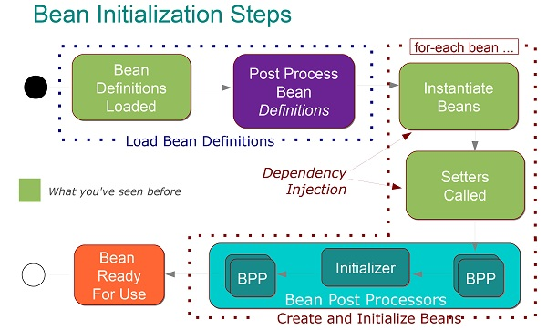

Main doc: https://docs.spring.io/spring/docs/current/spring-framework-reference/core.html

## 1. Spring Core annotations

#### @Configuration
`@Configuration` is used on classes which define beans.
Java class annotated with `@Configuration` is a configuration by itself and will have methods to instantiate and configure the dependencies.

Here is an example:

``` java
@Configuration
public class DataConfig{ 
  @Bean
  public DataSource source(){
    DataSource source = new OracleDataSource();
    source.setURL();
    source.setUser();
    return source;
  }
  @Bean
  public PlatformTransactionManager manager(){
    PlatformTransactionManager manager = new BasicDataSourceTransactionManager();
    manager.setDataSource(source());
    return manager;
  }
}
```

#### @Bean
`@Bean` is used  inside the `@Configuration` class on methods that instantiate and configure beans. The method annotated with this annotation works as bean ID.

```java
@Configuration
public class AppConfig{
  @Bean
  public Person person(){
    return new Person(address());
  }
}
```

#### @ComponentScan
This annotation is used with `@Configuration` annotation to allow Spring to know the packages to scan for annotated components. `@ComponentScan` is also used to specify base packages using `basePackageClasses` or `basePackage` attributes to scan. If specific packages are not defined, scanning will occur from the package of the class that declares this annotation.

#### @Autowired (JSR-330 @Inject)
This annotation is applied on fields, setter methods, and constructors. The `@Autowired` annotation injects object dependency implicitly.

When you use `@Autowired` on setter methods, Spring tries to perform the by Type autowiring on the method.

When you use `@Autowired` on a constructor, constructor injection happens at the time of object creation. It indicates the constructor to autowire when used as a bean. One thing to note here is that only one constructor of any bean class can carry the `@Autowired`  annotation.

NOTE: As of Spring 4.3, `@Autowired`  became optional on classes with a single constructor.

#### @Required
The @Required annotation applies to bean property setter methods, as in the following example:
```java
public class SimpleMovieLister {
    private MovieFinder movieFinder;

    @Required
    public void setMovieFinder(MovieFinder movieFinder) {
        this.movieFinder = movieFinder;
    }
}
```
This annotation indicates that the affected bean property must be populated at configuration time, through an explicit property value in a bean definition or through autowiring. The container throws an exception if the affected bean property has not been populated.

#### @Qualifier
This annotation is used along with `@Autowired` annotation. This annotation is used to avoid confusion which occurs when you create more than one bean of the same type and want to wire only one of them with a property:
```java

@Configuration
public class AwsSNSConfiguration {

    @Bean
    public AmazonSNS notificationsSns(@Value("${aws.default.region}") String awsRegion){
        return AmazonSNSClientBuilder
                .standard()
                .withRegion(awsRegion)
                .build();
    }
}

@Component
public class SMSGateway {
    private final AmazonSNS amazonSNS;

    public SMSGateway(@Qualifier("notificationsSns") AmazonSNS amazonSNS) {
        this.amazonSNS = amazonSNS;
    }
}
```

#### @Primary
This annotation is another way to resolve autowiring of multiple candidates (by type)
```java
@Configuration
public class MovieConfiguration {

    @Bean
    @Primary
    public MovieCatalog firstMovieCatalog() { ... }

    @Bean
    public MovieCatalog secondMovieCatalog() { ... }
}
```

#### @Value
This annotation is used at the field, constructor parameter, and method parameter level. The `@Value` annotation indicates a default value expression for the field or parameter to initialize the property with. As the `@Autowired` annotation tells Spring to inject object into another when it loads your application context, you can also use @Value annotation to inject values from a property file into a bean’s attribute. 

It supports both `#{...}` and `${...}` placeholders.

```java
@Value("${environment.identifier}")
public void setEnvironment(String environment) {
    this.environment = environment;
}
 ```

#### @Lazy
This annotation is used on a `@component` class if you want to initialize a bean lazily (only when it is first requested for).
By default all autowired dependencies are created and configured at startup.


#### Stereotype Annotations

- `@Component`\
This annotation is used to indicate a class as a bean add into the application context.
It's JSR-330 equivalents are `@Named` and `@ManagedBean`
- `@Controller`\
The annotation is used to indicate the class is a Spring controller for Spring MVC.
- `@Service`\
This annotation is a specialized form of the `@Component` annotation intended to be used in the service layer.
- `@Repository`\
Works as marker for any class that fulfills the role of repository or Data Access Object. This annotation has a automatic translation feature: when an exception occurs in the `@Repository` there is a handler for that exception and there is no need to add a try catch block.

#### @Resource
Spring also supports injection by using the JSR-250 `@Resource` annotation on fields or bean property setter methods.

`@Resource` takes a name attribute. By default, Spring interprets that value as the bean name to be injected. In other words, it follows *by-name* semantics
```java
public class SimpleMovieLister {
    private MovieFinder movieFinder;

    @Resource(name="myMovieFinder") 
    public void setMovieFinder(MovieFinder movieFinder) {
        this.movieFinder = movieFinder;
    }
}
```

## 2. General info about Spring IoC Container

#### BeanFactory vs ApplicationContext
A BeanFactory pretty much just instantiates and configures beans.
ApplicationContext is a sub-interface of BeanFactory that adds many additional features such as transactions and AOP.

#### Getting beans out of ApplicationContext
```java
@Autowired
private ApplicationContext context;

PetStoreService service = context.getBean("petStore", PetStoreService.class);
```

#### Bean Definitions
Spring IoC container holds "bean definitions" metadata that includes:
- Class\
A package-qualified class name: typically, the actual implementation class of the bean being defined
- Name\
If you do not supply a name or id explicitly, the container generates a unique name for that bean. If you use Javaconfiguration, the `@Bean` annotation can be used to provide aliases. 
- Scope
- Constructor arguments
- Properties
- Autowiring mode
- Lazy initialization mode
- Initialization method
- Destruction method

#### Dependency Injection
DI exists in two major variants: Constructor-based dependency injection and Setter-based dependency injection.

Constructor argument resolution matching occurs by using the argument’s type.

Setter-based DI is accomplished by the container calling setter methods on your beans after invoking a no-argument constructor.

#### Circular dependencies
If you use predominantly constructor injection, it is possible to create an unresolvable circular dependency scenario.

#### Using @DependsOn
Beans on which the current bean depends. Any beans specified are guaranteed to be created by the container before this bean. 
Used in cases where a bean does not explicitly depend on another through properties or constructor arguments, but rather depends on the side effects of another bean's initialization, e.g:
```java
@Configuration
@ComponentScan
public class Config {
  
    @Bean
    @DependsOn({"fileReader","fileWriter"})
    public FileProcessor fileProcessor(){
        return new FileProcessor();
    }
     
    @Bean("fileReader")
    public FileReader fileReader() {
        return new FileReader();
    }
     
    @Bean("fileWriter")
    public FileWriter fileWriter() {
        return new FileWriter();
    }   
}
```

#### Lazy-initialized Beans
By default, Spring creates all singleton beans eagerly at the startup of the application context. The reason behind this is simple: to avoid and detect all possible errors immediately rather than at runtime.

However, there’re cases when we need to create a bean, not at the application context startup, but when we request it, e.g:
```java
@Lazy
@Component
public class City {
    public City() {
        System.out.println("City bean initialized");
    }
}

public class Region {
 
    @Lazy
    @Autowired
    private City city;
 
    public Region() {
        System.out.println("Region bean initialized");
    }
 
    public City getCityInstance() {
        return city;
    }
}
```
Note, that the `@Lazy` is mandatory in both places!

#### Bean Scopes
Scope | Description
------------ | -------------
singleton | (Default) 
prototype | Scopes a single bean definition to any number of object instances.
request* | Scopes a single bean definition to the lifecycle of a single HTTP request. That is, each HTTP request has its own instance of a bean created off the back of a single bean definition.
session* | Scopes a single bean definition to the lifecycle of an HTTP Session.
application* | Scopes a single bean definition to the lifecycle of a ServletContext.
websocket* | Scopes a single bean definition to the lifecycle of a WebSocket.

\* - Only valid in the context of a web-aware Spring ApplicationContext.

#### Prototype scope
The non-singleton prototype scope of bean deployment results in the creation of a new bean instance every time a request for that specific bean is made. That is, the bean is injected into another bean or you request it through a `getBean()` method call on the container. 

As a rule, you should use the prototype scope for all stateful beans and the singleton scope for stateless beans.

#### Bean Lifecycle


#### Bean Lifecycle Callbacks
The JSR-250 `@PostConstruct` and `@PreDestroy` substitute former `init-method` and `destroy-method` approach.
```java
public class CachingMovieLister {

    @PostConstruct
    public void populateMovieCache() {
        // populates the movie cache upon initialization...
    }

    @PreDestroy
    public void clearMovieCache() {
        // clears the movie cache upon destruction...
    }
}
```

#### Customizing Beans by Using a `BeanPostProcessor`
Example of creating a custom annotation and a `BeanPostProcessor` for it:
```java
// create your own annotation
@Retention(RetentionPolicy.RUNTIME)
  @Target(ElementType.FIELD)
  public @interface InjectRandomInt {
      int min();
      int max();
  }
      
// create your own BeanPostProcessor to process this annotation
public class InjectRandomIntBeanPostProcessor implements BeanPostProcessor {
    private Random random = new Random();
    
    @Override
    public Object postProcessBeforeInitialization(Object bean, String beanName) throws BeansException {
        Field[] fields = bean.getClass().getDeclaredFields();
        for (Field field : fields) {
            InjectRandomInt annotation = field.getAnnotation(InjectRandomInt.class);
            if (annotation != null) {
                if(!field.getType().equals(int.class))
                    throw new RuntimeException("don't put @InjectRandomInt above " + field.getType());
                if (Modifier.isFinal(field.getModifiers())) {
                    throw new RuntimeException("can't inject to final fields");
                }
                int min = annotation.min();
                int max = annotation.max();
                int randomInt = min + random.nextInt(max - min);
                try {
                    field.setAccessible(true);
                    field.set(bean,randomInt);
                } catch (IllegalAccessException e) {
                    throw new RuntimeException(e);
                }
            }
        }
        return bean;
    }
    @Override
    public Object postProcessAfterInitialization(Object bean, String beanName) throws BeansException {
        return bean;
    }}
```

#### Composing the `@Configuration`s with `@Import`
`@Import` annotation allows for loading `@Bean` definitions from another configuration class.
Now, rather than needing to specify both `ConfigA.class` and `ConfigB.class` when instantiating the context, only `ConfigB.class` needs to be supplied explicitly, as the following example shows:

```java
@Configuration
public class ConfigA {

    @Bean
    public A a() {
        return new A();
    }
}

@Configuration
@Import(ConfigA.class)
public class ConfigB {

    @Bean
    public B b() {
        return new B();
    }
}

public static void main(String[] args) {
    ApplicationContext ctx = new AnnotationConfigApplicationContext(ConfigB.class);

    // now both beans A and B will be available...
    A a = ctx.getBean(A.class);
    B b = ctx.getBean(B.class);
}
```

#### Using `@Profile`
The `@Profile` annotation lets you indicate that a component is eligible for registration when one or more specified profiles are active.

The following operators are supported in profile expressions:
- `!` A logical “not” of the profile
- `&` A logical “and” of the profiles
- `|` A logical “or” of the profiles

Example: `@Profile({"p1", "!p2"})`

```java
@Configuration
public class AppConfig {

    @Bean("dataSource")
    @Profile("development") 
    public DataSource standaloneDataSource() {
        return new EmbeddedDatabaseBuilder()
            .setType(EmbeddedDatabaseType.HSQL)
            .addScript("classpath:com/bank/config/sql/schema.sql")
            .addScript("classpath:com/bank/config/sql/test-data.sql")
            .build();
    }

    @Bean("dataSource")
    @Profile("production") 
    public DataSource jndiDataSource() throws Exception {
        Context ctx = new InitialContext();
        return (DataSource) ctx.lookup("java:comp/env/jdbc/datasource");
    }
}
```

Activating a profile can be done in several ways, but the most straightforward is to do it programmatically against the Environment API which is available through an ApplicationContext. The following example shows how to do so:

```java
AnnotationConfigApplicationContext ctx = new AnnotationConfigApplicationContext();
ctx.getEnvironment().setActiveProfiles("development");
ctx.register(SomeConfig.class, StandaloneDataConfig.class, JndiDataConfig.class);
ctx.refresh();
```
Declaratively, `spring.profiles.active` may accept a comma-separated list of profile names, as the following example shows:
`-Dspring.profiles.active="profile1,profile2"`

The default profile represents the profile that is enabled by default. Consider the following example:

```java
@Configuration
@Profile("default")
public class DefaultDataConfig {

    @Bean
    public DataSource dataSource() {
        return new EmbeddedDatabaseBuilder()
            .setType(EmbeddedDatabaseType.HSQL)
            .addScript("classpath:com/bank/config/sql/schema.sql")
            .build();
    }
}
```
If no profile is active, the dataSource is created.


