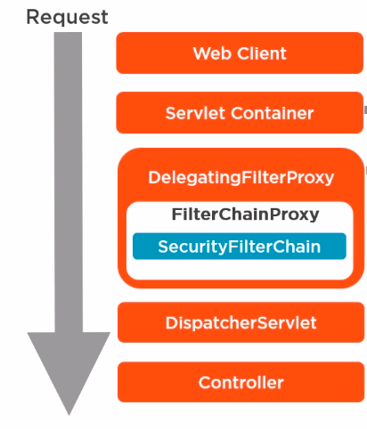
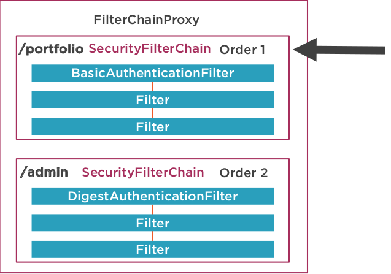

## Spring Security

Key components:  
- Delegating Filter Proxy - a servlet filter that delegates control via `doFilter()` method to Filter classes that have access to the Spring application context.
`DelegatingFilterProxy` is usually mapped to all incoming requests.
- Filter chain or chains. Contain a list of filters.
- Filters of `javax.Servlet.Filter` type. With the help of `DelegatingFilterProxy` they can be wired into the filter chain
- Dispatcher Servlet





#### Filter
Filter contains of 3 methods:
- `init`
- `doFilter(ServletRequest, ServletResponse, FilterChain)` - called on each request this filter is configured for. `FilterChain` gives ability to pass the request to next filters in the chain.
- `destroy`

Starting point to configure the security
```
@Configuration
public class SecurityConfiguration extends WebSecurityConfigurerAdapter {

    @Override
    protected void configure(HttpSecurity http) throws Exception {

    }
```

## General OAuth2 info

OAuth2 - **authorization** framework. It describes several "delegated authorization" flows.

OpenID Connect - **authentication** protocol based on OAuth2.\
It adds `id_token` (with identity details) to `access_token` response thus eliminating necessity to make antoher call to fetch profile info (identity details).\
It also ensures authentication process *happens right now*, at the moment of exchanging `access_code`.\
It also standardize some flow details, like name of claims and `/userinfo` endpoint.


OpenID Connect code flow example steps:
- Unauthenticated user visits service provider (SP) site
- Service offers him to authenticate with identity provider (IP)
- If user agrees, server redirects user to IP authorization endpoint, e.g. 
```
https://accounts.google.com/o/oauth2/auth?
redirect_uri=... // This is where user will be redirected back by the IP. Should match one of the given redirect uris in the IP account
response_type={code | id_token} // for basic and implicit flow correspondingly
scope=openid%20profile%20email // should start with `openid` to tell IP that this is OpenID Connect flow. Then predefined scopes can go like `profile` or `email` or others or custom scopes.
client_id=... // should match in the IP account
access_type=offline // `offline` tells IP to give also refresh_token
state=... // optional, anti-CSRF token for SP to ensure that this auth flow was initiated by him (when request makes a roundtrip and returns back to SP)
```
- User signs in to IP (if necessary)
- IP shows *consent screen* where user should accept or decline giving details of his identity to the SP. Details are requested in `scope`.
- If user agrees, IP redirects user to SP `redirect_uri` with `code` and `state` attached as URL params
- SP verifies `state` to be the same. Note: SP can store `state` or put it as secure HTTP cookie in the initial request. The latter is stateless.
- SP calls IP to exchange `code` for `token`, e.g.
```
POST /oauth2/v4/token HTTP/1.1
Host: www.googleapis.com
Content-Type: application/x-www-form-urlencoded

code=4/P7q7W91a-oMsCeLvIaQm6bTrgtp7&
client_id=8819981768.apps.googleusercontent.com&
client_secret={client_secret}&
redirect_uri=https://oauth2-login-demo.example.com/code& // not clear why to use redirect_uri second time here, but looks like extra security feature
grant_type=authorization_code
```
- IP responds with JSON object containing `access_token`, `id_token`, `expires_in`, `token_type = Bearer`, `refresh_token` (optional).
- SP in general should validate `id_token` signature and other essential details.
- SP extracts user identity details from `id_token` payload. It looks like:
```
{
 "iss": "https://accounts.google.com",
 "sub": "248289761001", // an identifier for the user
 "aud": "s6BhdRkqt3", // this one to prove the token was issued for *this* SP
 "nonce": "n-0S6_WzA2Mj", // this one against replay attack
 "exp": 1311281970,
 "iat": 1311280970,
 "email": "janedoe@example.com",
}
```
- SP can use `access_token` to make additional calls to IP, in case `id_token` payload is not enough.
- SP uses identity details to find user in local DB, fetch his roles, etc.
- SP can use `refresh_token` to obtain new `access_token`, in case old one expired.


https://oauth.net/articles/authentication/#common-pitfalls

### JWT structure
Decode JWT consists of 3 parts: header, payload and signature.\
Payload = claims. It can have some pre-defined claims (e.g. below) or custom ones.
```
Header
{
  "alg": "HS256",
  "typ": "JWT"
}
Payload:
{
  "iss": "1234567890", 
  "sub": "user",
  "aud": "service1.com", //intended recipient
  "iat": 1516239022, //issued at time
  "exp": 1516239022 //expiration time
}

