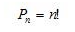
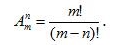
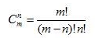

## Основные понятия комбинаторики

Три типа комбинаций: перестановки, размещения, сочетания.

### Перестановки (Permutations)
Комбинация из N элементов, которые отличаются друг от друга только порядком элементов, называются перестановками.

### Размещение (Arrangement)
Размещением (из m по n) называется _упорядоченный_ набор из n различных элементов из некоторого множества различных m элементов.

### Сочетания (Combinations)
Сочетанием из m по n называется набор из n элементов, выбранных из m-элементного множества, в котором не учитывается порядок элементов.

Число сочетаний из m по n равно биномиальному коэффициенту:

